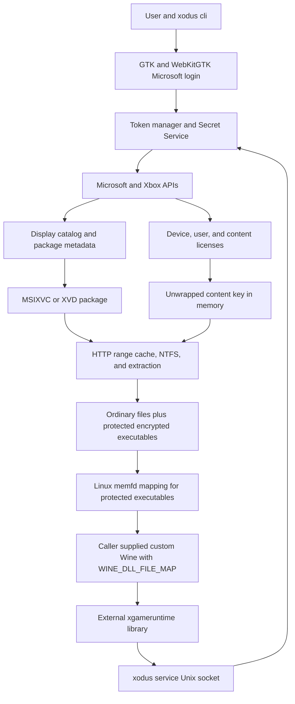

# Xodus CachyOS, Hyprland, Wayland, and NVIDIA Audit

## Audit Record

| Field | Value |
| --- | --- |
| Audit date | August 24, 2026 |
| Repository | `EnVisione/xodus` |
| Upstream | `xodus-gaming/xodus` |
| Audited branch | `main` before this audit branch was created |
| Audit branch | `envy/cachyos-audit` |
| Audited commit | `b3d7fb210301aac66b8aaef16c0450dcfadd451c` |
| Scope | Repository, existing documentation, local CachyOS environment, Hyprland, native Wayland and XWayland, NVIDIA RTX 5090 Laptop GPU, Wine and Proton launch readiness, Game Pass package flow, service integration, security, correctness, and performance readiness |
| Work boundary | Audit only. No implementation plan, product code, account state, operating system configuration, driver configuration, commit, push, or pull request was created as part of this work. |

## Decision

Xodus is **not ready for a near native, reliable Game Pass PC experience on this CachyOS machine**.

The repository has valuable working foundations:

- The full Rust workspace compiles in debug and release modes on CachyOS.
- Formatting passes.
- Seventeen offline tests pass.
- Microsoft and Xbox authentication, licensing, catalog access, MSIXVC parsing, encrypted executable retention, HTTP range streaming, Linux Secret Service storage, and a custom Wine handoff all have real implementations.
- The current CachyOS, Hyprland, XWayland, Wayland, Vulkan, and NVIDIA stack is modern enough to support a strong gaming path.

The missing work is still substantial:

- No entitled game was downloaded, installed, launched, or measured during this audit.
- The CLI does not configure or supervise a CachyOS Wine or Proton prefix, DXVK, VKD3D Proton, Wayland or XWayland presentation, NVIDIA device selection, shader caches, Gamescope, GameMode, or performance logging.
- The run path depends on a custom Wine implementation of `WINE_DLL_FILE_MAP`.
- `xgameruntime` and the local service protocol are incomplete.
- Package output paths are not proven to stay inside the destination directory.
- Package integrity, retry, recovery, and error propagation are incomplete.
- Several remotely influenced paths still panic or contain `todo!` and `unimplemented!` branches.
- There is no frame time baseline or regression harness, so “almost the same performance” is not measurable yet.

The correct next step is a plan grounded in this audit. That plan was intentionally not created because the requested stopping point is this audit.

## Completed Audit Steps

1. **Repository and remote identity:** verified the fork, upstream, branch, commit, dirty state, Git identity, signing configuration, current upstream issues, pull requests, and related Xodus repositories.
2. **Documentation first:** read every existing tracked Markdown document completely before forming compatibility conclusions.
3. **Implementation inspection:** inspected the complete Rust workspace, manifests, lockfile, protocol definition, scripts, build configuration, command dispatch, authentication, licensing, storage, package, service, and runtime launch paths.
4. **CachyOS compatibility inspection:** measured the active kernel, compositor, session, display scaling, XWayland, NVIDIA driver, Vulkan layers, CPU, memory, storage, Wine, Proton, Gamescope, MangoHud, WebKitGTK, GTK, and Secret Service environment.
5. **Verification and audit:** ran formatting, metadata, compilation, lint, test compilation, offline tests, release build, script compilation, CLI smoke checks, backend smoke checks, dependency inspection, and static risk searches. Results and gaps are recorded below.

## Documentation Priority

Existing documentation was treated as primary design evidence. Code was checked against it rather than interpreting the code in isolation. The audit reviewed 14 tracked Markdown files, totaling 836 lines.

| Document | Priority evidence retained in this audit |
| --- | --- |
| [`README.md`](../../README.md) | Current project maturity, supported login, package download and license capabilities, encrypted executable progress, MSIXVC2 limitation, Linux prerequisites, custom Wine requirement, and the explicit warning that the project is experimental. |
| [`docs/README.md`](../README.md) | Documentation topology and ownership between Xbox research and Xodus behavior. |
| [`docs/xbox/MSAUserLogin.md`](../xbox/MSAUserLogin.md) | Microsoft account web login, token broker, RST, Sisu, user and device token chains, request metadata, and observed protocol behavior. |
| [`docs/xbox/README.md`](../xbox/README.md) | Xbox research index and subsystem boundaries. |
| [`docs/xbox/gamepass.md`](../xbox/gamepass.md) | Subscription enumeration, Game Pass product identifiers, and catalog relationship. |
| [`docs/xbox/gameruntime.md`](../xbox/gameruntime.md) | `xgameruntime.dll` role, title identity, user token IPC, Game Runtime API expectations, and Wine integration context. |
| [`docs/xbox/xboxlive.md`](../xbox/xboxlive.md) | Xbox Live scope and dependency relationships. |
| [`docs/xbox/xboxservices.md`](../xbox/xboxservices.md) | Device authentication, title authentication, service token exchange, relying parties, and Xbox service surfaces. |
| [`docs/xodus/README.md`](../xodus/README.md) | Xodus documentation index and project specific ownership. |
| [`docs/xodus/architecture.md`](../xodus/architecture.md) | Architectural invariants: protected executables remain encrypted on disk, repeated login should not be required, Microsoft services used by Steam titles should work, and integration should not be launcher specific. |
| [`docs/xodus/clep.md`](../xodus/clep.md) | CLEP challenge structure, hardware fields, obfuscation, and device license relationship. |
| [`docs/xodus/device.md`](../xodus/device.md) | Device provisioning, hardware components, device credentials, device licenses, and the documented omission of TPM information. |
| [`docs/xodus/licenses.md`](../xodus/licenses.md) | Content license request flow, CIK handling, content keys, and persistent encrypted content expectations. |
| [`docs/xodus/login.md`](../xodus/login.md) | Current login flow, token persistence expectations, and platform login behavior. |

### Documentation to Code Reconciliation

The code generally reflects the documented research for Microsoft account login, device tokens, CLEP, content licensing, and encrypted executable retention. Important differences remain:

- The architectural goals describe a complete launcher neutral runtime, but the code currently exposes low level CLI primitives and a partial service prototype.
- The documented Game Runtime model is broader than the service implementation. The service handles ping and one XML MSA token request path; its Protobuf path is unimplemented.
- The documentation identifies TPM information as missing, and the code still emits error components for it.
- The README correctly marks MSIXVC2 unsupported.
- The README describes a custom Wine requirement. The code confirms that requirement by passing `WINE_DLL_FILE_MAP` to a caller supplied Wine binary.
- The documentation does not currently capture the CachyOS, Hyprland, Wayland, XWayland, NVIDIA, DXVK, VKD3D, Gamescope, GameMode, scaling, performance, recovery, and containment requirements found by this audit.

## Repository and Upstream State

### Fork State

- `origin` is `https://github.com/EnVisione/xodus.git`.
- `upstream` is `https://github.com/xodus-gaming/xodus.git`.
- Before the audit branch was created, local `main`, `origin/main`, and `upstream/main` all pointed to `b3d7fb210301aac66b8aaef16c0450dcfadd451c`.
- The fork was zero commits ahead and zero commits behind upstream at inspection time.
- The repository is public and licensed under GPL 3.0.

### Active Upstream Work

Upstream is moving quickly. The current audit must be refreshed before implementation begins.

- [Upstream pull request 156](https://github.com/xodus-gaming/xodus/pull/156), “Resumable downloads, reclaimed install space, and the Xbox Live token chain,” is open and blocked on review. It overlaps streaming, launch, package resolution, service routing, service XML, Xbox authentication, token management, and protocol files.
- [Upstream pull request 147](https://github.com/xodus-gaming/xodus/pull/147) targets SMBIOS panic handling.
- [Upstream pull request 136](https://github.com/xodus-gaming/xodus/pull/136) targets MSIXVC panic propagation.
- [Upstream issue 73](https://github.com/xodus-gaming/xodus/issues/73) tracks Game Pass compatibility.
- [Upstream issue 106](https://github.com/xodus-gaming/xodus/issues/106) tracks nondeterministic default executable selection.
- [Upstream issue 120](https://github.com/xodus-gaming/xodus/issues/120) tracks Polkit hardware probing hangs.
- [Upstream issue 130](https://github.com/xodus-gaming/xodus/issues/130) tracks streaming panic behavior.
- [Upstream issue 144](https://github.com/xodus-gaming/xodus/issues/144) tracks malformed SMBIOS panics.
- [Upstream issue 146](https://github.com/xodus-gaming/xodus/issues/146) tracks a SOAP decryption buffer panic.
- [Upstream issue 148](https://github.com/xodus-gaming/xodus/issues/148) tracks Linux distribution packaging.

Any future fork work should either rebase after overlapping upstream changes or deliberately isolate CachyOS integration behind stable interfaces.

### Fork GitHub Baseline

The fork has no pull requests, Actions runs, releases, rulesets, protected environments, or default branch protection. Issues are disabled. Cargo and GitHub Actions Dependabot coverage is absent. No repository security policy, CODEOWNERS policy, or CodeQL configuration is present.

These are repository hygiene gaps, not native runtime blockers. They were not changed because this work stops at the audit.

## Codebase Inventory

| Item | Count |
| --- | ---: |
| Tracked files | 136 |
| Rust source files | 90 |
| Rust source lines | 11,096 |
| Cargo manifests | 6 |
| Protocol Buffer definitions | 1 |
| Workspace crates | 5 |

The workspace consists of:

- `msixvc-common`: compile time sized binary parsing primitives.
- `msixvc`: XVD and XSP structures, cryptography, streaming, NTFS handling, extraction, and protected executable mapping.
- `xodus`: authentication, tokens, secrets, hardware identity, CLEP, Microsoft and Xbox APIs, licensing, and shared protocol models.
- `xodus-cli`: login, download, streaming, extraction, license, CLEP, and Wine launch commands.
- `xodus-service`: per user Unix socket service for the external Game Runtime layer.

## Current Architecture

This is a useful separation of concerns, but the final launch path has no integrated platform policy. Native performance work belongs around the Wine and Proton handoff and service lifecycle. It should not be mixed into authentication or package parsing.

## Audited CachyOS Machine

### Operating System and Session

| Component | Observed value |
| --- | --- |
| Distribution | CachyOS rolling, Arch based |
| Kernel | `7.2.0-1-cachyos`, `PREEMPT_DYNAMIC` |
| Session | Wayland |
| Compositor | Hyprland 0.56.2 |
| Rendering backend | Aquamarine 0.14.0, DRM |
| Wayland | 1.26.0 |
| Wayland protocols | 1.49 |
| XWayland | 24.1.13 |
| `WAYLAND_DISPLAY` | `wayland-1` |
| `DISPLAY` | `:1` |
| `GBM_BACKEND` | `nvidia-drm` |
| Hyprland XWayland scaling | `force_zero_scaling = true` |
| Hyprland NVIDIA anti flicker | enabled by default |
| Hyprland tearing | disabled |
| Hyprland direct scanout | disabled by current configuration or state |

Only the internal `eDP-1` display was active during the audit. No HDMI output was available for verification.

### Display

| Component | Observed value |
| --- | --- |
| Panel | BOE NE180QAM-NZ2 |
| Native mode | 3840 by 2400 at 240 Hz |
| Scale | 2.0, or 200 percent |
| Current format | XRGB8888 |
| VRR | Supported by the display stack, inactive during inspection |
| Direct scanout | Inactive |
| Active tearing | No |

This is a high DPI panel, not a standard 3840 by 2160 4K panel. XWayland is currently unscaled by Hyprland, which avoids compositor blur but requires applications and game launchers to manage their own logical scaling. The future launcher must keep the login UI readable at 200 percent while allowing games to render at a chosen physical resolution without double scaling.

### GPU and Graphics Stack

| Component | Observed value |
| --- | --- |
| GPU | NVIDIA GeForce RTX 5090 Laptop GPU, PCI vendor `10de`, device `2c58` |
| Architecture | Blackwell, GB203M |
| Driver | NVIDIA 610.57.04 proprietary user space |
| Kernel module | NVIDIA open kernel module 610.57.04 |
| VRAM | 24,463 MiB |
| Vulkan loader | 1.4.357 |
| NVIDIA Vulkan API | 1.4.341 |
| Vulkan surfaces | Wayland, XCB, and Xlib available |
| 64 bit NVIDIA libraries | installed |
| 32 bit NVIDIA libraries | installed |
| EGL Wayland and GBM | installed |
| Vulkan layers | Gamescope WSI, MangoHud, NVIDIA Optimus, NVIDIA present, Steam Fossilize, and Steam overlay layers observed |

The GPU was in P0 during inspection, but other applications were active. That state is not a Xodus performance result. NVIDIA reported a 95 W default power limit and 175 W hardware maximum. The audit did not change firmware mode, Dynamic Boost, power limits, clocks, or system profiles.

The machine satisfies Hyprland's current NVIDIA baseline: a 50 series GPU uses the open kernel module, the driver is newer than 555, XWayland is newer than 24.1, and Wayland protocols are newer than 1.34. See the [Hyprland NVIDIA guidance](https://wiki.hypr.land/Nvidia/) and [NVIDIA Wayland known issues](https://download.nvidia.com/XFree86/Linux-x86_64/560.35.03/README/wayland-issues.html).

### CPU, Memory, and Storage

| Component | Observed value |
| --- | --- |
| CPU | Intel Core Ultra 9 275HX |
| Logical CPUs | 24 |
| Maximum reported frequency | 5.4 GHz |
| Memory | 62 GiB total, about 52 GiB available during inspection |
| Swap | 62 GiB |
| Home filesystem | about 1.3 TiB free |

The machine has enough CPU, memory, VRAM, and storage for development and high end game testing. Performance risk is primarily compatibility, launch policy, frame presentation, shader behavior, power behavior, and runtime completeness rather than insufficient hardware.

### Installed Runtime Components

| Component | Installed version |
| --- | --- |
| Rust | 1.98.0 |
| Cargo | 1.98.0 |
| Protobuf compiler | 35.1 |
| GTK 3 | 3.24.52 |
| WebKitGTK 4.1 | 2.52.6 |
| Wine | 11.16 |
| Wine CachyOS optimized build | `10.0.20260425` |
| Proton CachyOS SLR | `11.0.20260703` |
| Gamescope | 3.16.25 |
| MangoHud | 0.8.4 |
| NVIDIA utilities | 610.57.04, 64 bit and 32 bit |

The Linux Secret Service is active through GNOME Keyring and exposes `org.freedesktop.secrets`, matching the repository's Linux keyring backend.

No separate system DXVK or VKD3D Proton packages were identified. Proton normally bundles its selected graphics translation components, so future work must discover and validate the exact per Proton runtime versions rather than assuming system packages.

## Build and Test Verification

| Check | Result | Evidence |
| --- | --- | --- |
| `cargo fmt --check --all` | Pass | No formatting changes required. |
| `cargo metadata --format-version 1 --no-deps` | Pass | All five workspace crates resolved. |
| `cargo check --workspace --all-targets` | Pass | Debug compilation completed for all targets. |
| `cargo clippy --workspace --all-targets --all-features` | Pass with warnings | Four warnings: one exact chunk suggestion, two functions with too many arguments, and one identity mapping suggestion. |
| `cargo test --workspace --all-targets --no-run` | Pass | All test binaries compiled. |
| Offline test run with account tests skipped | Pass | 17 tests passed. Five in `msixvc`, three in `msixvc-common`, nine in `xodus`, zero in the CLI, and zero in the service. |
| `cargo build --release --workspace` | Pass | All release binaries built. |
| Python script bytecode compilation | Pass | Both developer scripts parsed successfully. Generated cache files were removed after the check. |
| Release CLI help | Pass | Command parsing and binary startup worked. |
| GTK backend smoke checks | Limited pass | A side effect free CLEP command ran with both `GDK_BACKEND=wayland` and `GDK_BACKEND=x11`. This does not validate the login webview. |

### Tests Not Run

- `api::live::test::test_get_xbox_live_dev_token` was skipped because it uses external account and service state.
- `auth::test_minecraft_win_auth` was skipped because it is an ignored external authentication test.
- Microsoft login was not opened because it can provision or mutate account and device state.
- No entitlement, device license, content license, Game Pass catalog, package download, extraction, service to `xgameruntime`, or real game launch test was run.
- No external HDMI display test was possible because only `eDP-1` was active.
- No 32 bit game process was launched, even though the 32 bit NVIDIA stack is installed.
- No frame time, input latency, shader compilation, VRAM, GPU power, CPU scheduling, suspend, resume, focus loss, controller, audio, save, multiplayer, or cloud save test was run.

Compilation proves source compatibility with the current CachyOS toolchain. It does not prove product compatibility.

## Capability Matrix

| Capability | Implementation | Local verification | Audit status |
| --- | --- | --- | --- |
| Microsoft web login | Implemented with Tao, Wry, GTK, and WebKitGTK | Compiles only | Needs account backed Wayland and XWayland tests |
| Secret persistence | Linux Secret Service backend implemented | Service available locally | Backend ready, lifecycle not fully exercised |
| Device provisioning | Implemented | Not externally exercised | Fragile hardware probing blocks production confidence |
| User and device tokens | Implemented with persistent and memory stores | Unit coverage only | Needs expiry, refresh, logout, and failure coverage |
| Xbox catalog and package lookup | Implemented | Not externally exercised | Needs HTTP and schema failure hardening |
| Content license acquisition | Implemented | Parser tests only | Needs entitlement and failure tests |
| MSIXVC parsing | Implemented | Builds and partial unit coverage | Needs real fixture and malformed package coverage |
| MSIXVC2 | Not implemented | Not applicable | Blocking for titles distributed only in MSIXVC2 |
| XSP parsing | Implemented at model level | Compiles | Update application workflow is incomplete |
| HTTP resume | Implemented in streaming reader | Four focused tests pass | Useful foundation |
| Download retry and CDN fallback | Not implemented in CLI download | Not applicable | Required for reliability |
| Package integrity verification | Partial structures exist | Not proven end to end | Required before cache promotion |
| Safe destination containment | Not implemented visibly | Not tested | Security blocker |
| Encrypted executable retention | Implemented | Compiles | Needs real package proof |
| Linux executable mapping | Implemented with `memfd` | Compiles | Needs custom Wine proof |
| Wine handoff | Caller supplied binary plus `WINE_DLL_FILE_MAP` | Not launched | No integrated runtime policy |
| Proton prefix management | Not implemented | Not applicable | Required for repeatable game execution |
| DXVK and VKD3D Proton selection | Not implemented | Vulkan available locally | Required for graphics compatibility |
| Wayland game presentation | Not implemented | Session available | Requires native and XWayland launch strategy |
| Hyprland integration | Not implemented | Environment audited | Requires focus, scaling, fullscreen, VRR, and direct scanout policy |
| NVIDIA device selection | Not implemented | One discrete GPU observed | Must still be explicit and verified in Wine |
| Gamescope and GameMode | Not implemented | Gamescope installed | Optional per title, not a default cure |
| `xodus-service` XML IPC | Ping and MSA token request implemented | Compiles | Incomplete and insufficiently hardened |
| `xodus-service` Protobuf IPC | `unimplemented!` | Not applicable | Blocking if a client selects it |
| `xgameruntime` coverage | Separate active repository | Not built in this audit | Broad API areas remain incomplete |
| Achievements, social, store, package UI, and cloud saves | Not implemented in this repository | Not applicable | Depend on future runtime and service work |
| Anti cheat | No bypass and no general solution | Not applicable | Unsupported titles must use an allowed cloud path |
| Performance telemetry | Not integrated | MangoHud available | Required to prove smoothness |

## Compatibility Layer Analysis

### CachyOS

The repository builds cleanly on the current rolling toolchain. No CachyOS package manifest, PKGBUILD, launcher wrapper, systemd user unit, dependency validator, or update compatibility policy exists. A rolling distribution can change Rust, WebKitGTK, GTK, OpenSSL, DBus, Wine, Proton, the NVIDIA driver, and kernel behavior independently. Reproducibility therefore needs explicit version reporting and startup diagnostics.

Global system tuning should not be the first approach. The project needs per launch settings and measurements so it can distinguish Xodus defects from desktop wide changes.

### Native Wayland Login

The Linux login webview uses `WebViewBuilderExtUnix::build_gtk`, which is the Wry path recommended for GTK containers on X11 and Wayland. See [Wry's Linux platform guidance](https://docs.rs/wry/latest/wry/). The dependency still enables Wry's default X11 feature, and the binary links both X11 and Wayland related libraries.

The code does not select or report a backend. GTK chooses from the environment. A future implementation must validate native Wayland login and retain an XWayland fallback without changing the game presentation policy. The webview must also be tested at 200 percent scaling.

### XWayland Game Presentation

Most Windows games launched through Wine or Proton will still use XWayland for common DXVK and VKD3D paths. The local stack meets current explicit synchronization version requirements. That removes one major historical NVIDIA blocker, but it does not guarantee correct frame ordering for every title.

Hyprland has `xwayland:force_zero_scaling = true`, so the game should receive physical pixels without compositor scale blur. The launcher must set the game's requested resolution and DPI behavior deliberately. It must not apply a second global scale of two to the game.

### NVIDIA RTX 5090 Laptop GPU

The current open kernel module and proprietary user space combination is correct for a 50 series GPU according to current Hyprland guidance. Vulkan exposes the NVIDIA GPU and all required surface types. Both 64 bit and 32 bit NVIDIA user space libraries are installed.

Remaining risks are runtime device selection, laptop power policy, Dynamic Boost, frame pacing, shader compilation, VRR, direct scanout, fullscreen behavior, and driver regressions. The project must measure these per title. It must not hardcode a 175 W power limit or assume P0 is always desirable outside active gameplay.

### Wine and Proton

The run command accepts an arbitrary `wine` string and starts one executable with `WINE_DLL_FILE_MAP` at [`crates/xodus-cli/src/commands/run.rs:240`](../../crates/xodus-cli/src/commands/run.rs#L240). It does not:

- Discover the Xodus patched Wine or Proton build.
- Create, validate, migrate, or isolate a Wine prefix.
- Configure Windows version, registry state, Game Runtime libraries, dependencies, fonts, controllers, audio, or per title overrides.
- Select DXVK or VKD3D Proton.
- Export NVIDIA shader cache settings or verify the selected Vulkan device.
- Choose Wayland or XWayland presentation.
- Start and supervise `xodus-service`.
- Manage Gamescope, GameMode, MangoHud, Steam integration, or desktop shortcuts.
- Capture a support bundle or frame time trace.
- Clean a failed child process tree or recover a damaged prefix.

Near native graphics performance is possible only after the runtime contract is complete. Xodus authentication and package support do not replace Proton's Windows API, graphics, multimedia, input, and runtime compatibility work.

### Game Runtime

The separate [xodus-gaming/xgameruntime](https://github.com/xodus-gaming/xgameruntime) repository is active and designed for Wine with Xodus. Its current open tracking issues include XAsync and task queues, XUser, XStore, XGameUi, XPackage, accessibility, speech, and general GDK integration. Two draft pull requests explore Unix socket integration approaches.

This means the fork cannot finish the Xbox PC app experience through changes to this repository alone. Future work must define a versioned interface across at least Xodus, `xgameruntime`, and the Xodus Wine or Proton patches.

## Findings

Severity meanings:

- **Blocker:** prevents a trustworthy end to end target game result.
- **High:** can cause security exposure, corruption, false success, repeated failure, or a major compatibility gap.
- **Medium:** important for maintainability, repeatability, diagnostics, or sustained performance.

### A01. No End to End Native Game Proof

**Severity:** Blocker

The code compiles, but no account backed flow or real game has been verified on this machine. Authentication, entitlement, download, license acquisition, extraction, service startup, protected executable mapping, Wine launch, Game Runtime behavior, graphics presentation, input, audio, saving, and shutdown have not been proven as one chain.

**Required evidence before claiming native support:** one entitled Game Pass target must complete every stage twice from a clean supportable state, with logs that contain no secrets and a repeatable recovery path.

### A02. Package Paths Are Not Proven to Stay Inside the Destination

**Severity:** Blocker

Streaming constructs the output path with `out.join(job.name.replace("\\", "/"))` at [`crates/xodus-cli/src/commands/streaming.rs:404`](../../crates/xodus-cli/src/commands/streaming.rs#L404). There is no visible rejection of absolute paths, drive prefixes, parent components, repeated separators, or a canonicalized path outside the destination.

A crafted or malformed package name could write outside the selected game directory. Microsoft CDN trust lowers normal exposure but does not remove parser safety requirements.

**Required direction:** parse package paths into a platform independent relative path, reject unsafe components, prove lexical and canonical containment, handle symbolic links, and test hostile package names before creating files.

### A03. Service IPC Is Incomplete and Needs Security Hardening

**Severity:** High

Positive behavior exists: the socket is placed under `$XDG_RUNTIME_DIR` and changed to mode 0600 at [`crates/xodus-service/src/main.rs:30`](../../crates/xodus-service/src/main.rs#L30).

Gaps:

- The service records a peer process identifier but does not explicitly reject a different user at [`crates/xodus-service/src/connection/router.rs:16`](../../crates/xodus-service/src/connection/router.rs#L16).
- A stale `xodus.sock` is removed only after orderly shutdown, so a crash can block the next bind.
- The Protobuf path is `unimplemented!` at [`crates/xodus-service/src/connection/proto.rs:7`](../../crates/xodus-service/src/connection/proto.rs#L7).
- XML support is limited to ping and one MSA token request.
- Message length uses 16 bits, but there are no read timeouts, request rate limits, or connection limits.
- Debug logging prints raw and decoded MSA request buffers at [`crates/xodus-service/src/connection/xml.rs:44`](../../crates/xodus-service/src/connection/xml.rs#L44).
- Error branches still use `todo!`.
- The user name passed to token exchange is the literal `USERNAME` at [`crates/xodus-service/src/connection/xml.rs:79`](../../crates/xodus-service/src/connection/xml.rs#L79).
- Startup panics when secrets, device credentials, or socket setup fail.

The service handles security sensitive tokens and must fail closed with redacted, actionable errors.

### A04. Streaming Can Report Success After Internal Failure

**Severity:** High

The inner streaming function returns `()` and prints errors before returning. The outer command returns `ExitCode::SUCCESS` unconditionally at [`crates/xodus-cli/src/commands/streaming.rs:151`](../../crates/xodus-cli/src/commands/streaming.rs#L151).

This can tell scripts and users that an install succeeded when licensing, disk space, parsing, extraction, or final cache promotion failed.

**Required direction:** return a typed result from every streaming layer, cancel sibling jobs on failure, preserve the first meaningful error, clean or quarantine partial state, and map failures to a nonzero exit code.

### A05. The Launch Command Is a Primitive, Not a Runtime Orchestrator

**Severity:** High

The run path parses the cached XVD, obtains a content key, maps protected executables to `memfd`, selects an entry, and starts a caller supplied Wine binary. This proves a useful low level concept.

It selects the first mapped executable when `--exe` is absent at [`crates/xodus-cli/src/commands/run.rs:228`](../../crates/xodus-cli/src/commands/run.rs#L228). It does not resolve the official package entrypoint or manifest. It also assumes the custom Wine patch, prefix, Game Runtime, graphics translation, dependencies, environment, service, and child process behavior are already correct.

The default executable is therefore nondeterministic relative to package map iteration, matching upstream issue 106.

### A06. Download and Cache Integrity Are Incomplete

**Severity:** High

The simple download command:

- Uses the first CDN root without fallback at [`crates/xodus-cli/src/commands/download.rs:60`](../../crates/xodus-cli/src/commands/download.rs#L60).
- Does not call `error_for_status` before streaming the response.
- Truncates the destination before the full response is validated.
- Has no retry, resume, expected length, hash, atomic promotion, or safe filename validation.

The streaming reader has better HTTP range and resume validation, and its focused tests pass. The final extraction workflow still empties `data_hashs` for jobs, does not visibly verify every extracted block against package hashes, removes the previous cache, and renames the temporary cache with `expect` at [`crates/xodus-cli/src/commands/streaming.rs:460`](../../crates/xodus-cli/src/commands/streaming.rs#L460).

Crash recovery and atomic promotion are not complete. An existing good cache can be lost before the new cache is proven durable.

### A07. Linux Hardware Identity Probing Is Fragile

**Severity:** High

Linux hardware provisioning uses a constant disk serial, `AA==`, at [`crates/xodus/src/hardware.rs:18`](../../crates/xodus/src/hardware.rs#L18). It launches `pkexec cat /sys/firmware/dmi/entries/1-0/raw` at [`crates/xodus/src/hardware.rs:155`](../../crates/xodus/src/hardware.rs#L155). This can block waiting for a Polkit agent and adds an interactive privilege dependency to login.

The parser directly indexes the raw SMBIOS buffer and its string table at [`crates/xodus/src/hardware.rs:116`](../../crates/xodus/src/hardware.rs#L116). Short or unexpected data can panic. TPM information remains absent, matching the existing documentation.

Hardware identity must be stable, privacy conscious, nonblocking, testable with fixtures, and tolerant of unavailable fields.

### A08. Remotely Influenced Error Paths Still Panic

**Severity:** High

A raw static inventory across Rust sources found 115 `unwrap` calls, 67 `expect` calls, five `panic!` calls, five `todo!` calls, and two `unimplemented!` calls. This count includes tests and invariant assertions, so it is not a defect count. It identifies a large review surface.

Confirmed production concerns include:

- Unsupported XVD encryption key identifiers use `todo!` at [`crates/msixvc/src/xvd.rs:404`](../../crates/msixvc/src/xvd.rs#L404).
- Unsupported XVD block sizes use `todo!` at [`crates/msixvc/src/xvd.rs:684`](../../crates/msixvc/src/xvd.rs#L684).
- Xbox API branches use `panic!("TODO")`.
- SOAP token exchange has unsupported token `todo!` and `unimplemented!` branches.
- License content indexes the first key without checking an empty collection at [`crates/xodus/src/licensing/content.rs:74`](../../crates/xodus/src/licensing/content.rs#L74).
- Streaming and launch perform many `expect` and `unwrap` calls on network, package, file, license, and process results.

One explicit unsafe block reshapes a generic array at [`crates/msixvc-common/src/parse.rs:292`](../../crates/msixvc-common/src/parse.rs#L292). Its size and layout invariant is documented. It is not proven defective, but it should remain isolated and covered by layout and parser tests.

### A09. Format and Update Coverage Is Incomplete

**Severity:** High

- MSIXVC2 is unsupported.
- XSP structures are parsed, but the CLI does not provide a complete, verified update application workflow.
- Only encryption key identifier zero and unencrypted content are handled in one XVD path.
- Only known block sizes are accepted.
- No compatibility matrix maps current Game Pass titles to MSIXVC, MSIXVC2, EAppx, required GDK APIs, and runtime features.

A target title can fail before Wine starts because package and install support are title specific.

### A10. Network and Token Lifecycle Needs Stronger Failure Handling

**Severity:** Medium

Some HTTP paths correctly use `error_for_status`; others attempt to deserialize expected success schemas from error responses or panic on missing fields. Service endpoints, title identifiers, relying parties, and Windows build metadata are hardcoded.

Device and user state persist through the keyring. XSTS and some exchanged service tokens are memory only. There is no single explicit refresh scheduler, expiry policy, or retry budget. Normal logout leaves device credentials unless `--device` is selected, which may be intended but needs clearer lifecycle documentation and tests.

The service and CLI enable verbose connection logging. Future support logging must redact credentials and request bodies by default.

### A11. Dependency and Quality Tooling Has Gaps

**Severity:** Medium

- The workspace directly uses Reqwest 0.13.4 while pinned `xal-rs` uses Reqwest 0.11.27, producing duplicate HTTP and TLS dependency graphs.
- The `ntfs` Git patch is reproducible through `Cargo.lock`, but its manifest patch does not specify a revision.
- Clippy passes with four warnings rather than a warning free baseline.
- `cargo-audit` and `cargo-deny` were not installed, so advisory, license, duplicate, and source policy scans were not run.
- The CLI and service contain no unit tests.
- No fixture based full XVD extraction test exists in the audited suite.

### A12. No Performance Baseline Exists

**Severity:** Medium

The repository contains no frame time capture, benchmark schema, comparison threshold, hardware snapshot, graphics API confirmation, or per title performance report. There is no way to distinguish average FPS from smooth frame pacing, shader stutter, compositor latency, CPU stalls, GPU power limits, or runtime API stalls.

“Maximum performance” must be defined with repeatable evidence. At minimum, future acceptance needs average FPS, 1 percent low, 0.1 percent low, frame time variance, shader compilation events, GPU utilization, VRAM use, clocks, power, CPU utilization, resolution, refresh rate, graphics settings, presentation path, driver, Proton build, and a stable test scene.

### A13. Desktop Features Are Available but Not Yet Used Correctly

**Severity:** Medium

Gamescope, MangoHud, Steam shader layers, high refresh output, and Hyprland native features are present. Turning all of them on unconditionally could add extra composition, scaling, or debugging overhead.

Future policy should choose the smallest per title stack:

- Direct Wine or Proton under XWayland when presentation is stable.
- Gamescope only when it solves fullscreen, scaling, refresh, HDR, or frame pacing for the title.
- MangoHud during measurement and optional user display, not as a hidden correctness dependency.
- GameMode only after verifying that its daemon and policies improve this CachyOS laptop rather than fighting the system profile.
- Direct scanout, VRR, tearing, and frame caps only through measured title profiles.

## Game Pass Ultimate Target

### Primary Performance Target: Forza Horizon 5

[Forza Horizon 5](https://www.xbox.com/en-US/games/forza-horizon-5) is the recommended primary target for the later plan.

Reasons:

- Xbox currently lists it for Windows PC and includes it with Game Pass, including Ultimate.
- It is graphically demanding enough to exercise VKD3D or DXVK behavior, shader compilation, VRAM, high refresh presentation, frame pacing, audio, controller input, saves, Xbox identity, and online service dependencies.
- Its driving workload provides repeatable scenes for performance comparison.
- Xbox also lists a cloud gaming path, so Game Pass Ultimate provides an allowed fallback if the native runtime or a protected online component remains unsupported.

This is a target, not a compatibility claim. Before download, the later plan must query the entitled package and record its actual package format, architecture, dependencies, entrypoint, executable protection, Game Runtime imports, service endpoints, and anti cheat components.

### Functional Canary: Minecraft for Windows

[Minecraft for Windows](https://www.xbox.com/en-us/games/store/Minecraft-for-Windows/9NBLGGH2JHXJ) should remain a smaller functional canary because the repository already contains a Minecraft authentication test and upstream history discusses it. It can validate login, entitlement, package, license, service, and basic GDK launch behavior before spending time on a demanding performance target.

Minecraft is not sufficient as the only performance target for an RTX 5090 Laptop GPU.

## Anti Cheat Boundary and Cloud Fallback

No anti cheat bypass should be attempted. For each target, later work must identify required kernel drivers, Windows services, protected launchers, server side platform checks, and publisher policy before claiming compatibility.

If a title cannot run because its anti cheat or protected service intentionally rejects Wine or Linux, the supported response is:

1. Record the exact blocker and publisher support status.
2. Avoid weakening the system or bypassing the control.
3. Offer the user's existing Xbox cloud gaming path when the title and subscription support it.

Cloud gaming is a fallback category. It is not evidence that native Xodus execution works.

## Performance and Compatibility Evidence Required Before Release Claims

Any future implementation plan should require all of the following before describing the fork as fast or native ready:

- A reproducible CachyOS package and runtime dependency check.
- A versioned Xodus patched Wine or Proton build with a documented source commit.
- A per game prefix with deterministic creation, migration, backup, and reset behavior.
- Deterministic manifest based entrypoint resolution.
- Automatic, verified service and `xgameruntime` deployment.
- Explicit native Wayland login and XWayland game paths.
- Correct behavior at Hyprland scale 2.0 without a blurry or double scaled game.
- NVIDIA Vulkan device confirmation in both 64 bit and 32 bit processes.
- Exact DXVK or VKD3D Proton version and log confirmation.
- Safe package paths, full package integrity validation, CDN retry, resume, atomic cache promotion, and crash recovery.
- Typed errors and correct nonzero CLI exit codes.
- Secret redaction and same user IPC authorization.
- Two consecutive successful launches after a clean installation.
- Controller, keyboard, mouse, audio, focus, fullscreen, save, suspend, resume, and clean shutdown checks.
- Frame time evidence at a documented resolution and graphics preset.
- A comparison against the same title on the same hardware under a known working Windows baseline when a fair comparison is available.
- An explicit cloud fallback result for unsupported anti cheat or Game Runtime dependencies.

## Audit Conclusion

The local machine is a strong target for this work. CachyOS, Hyprland, current XWayland, the NVIDIA 610 open kernel module stack, complete 64 bit and 32 bit NVIDIA user space, Vulkan, Wine, CachyOS Proton, Gamescope, MangoHud, high refresh output, and 200 percent scaling are all present.

The repository is earlier than the hardware. Its strongest parts are authentication research, license handling, MSIXVC foundations, encrypted executable retention, and HTTP range streaming. Its weakest parts are end to end orchestration, service completeness, parser and error hardening, safe installation, package integrity, runtime versioning, Game Runtime coverage, and measurable performance policy.

Forza Horizon 5 is the correct later performance target, with Minecraft for Windows as a smaller functional canary. Achieving a smooth result will require coordinated work across this fork, `xgameruntime`, and the Xodus Wine or Proton patches. It cannot be achieved by adding one launch flag or globally enabling every gaming tool.

No plan or implementation work follows this document in the current task.
