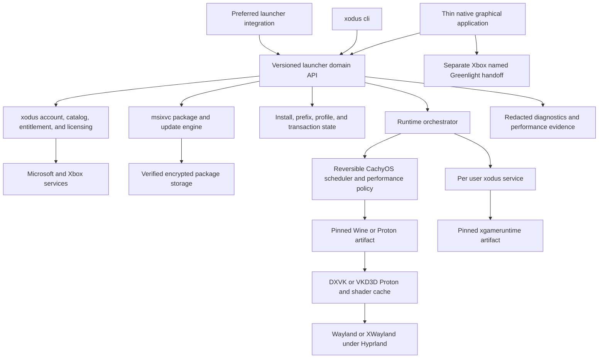

# Xodus CachyOS Game Pass Launcher and Runtime Plan

> **Plan ID:** PLAN-MASTER
> **Plan status:** VALIDATED WITH KNOWN EXTERNAL BLOCKER
> **Project state:** EXISTING
> **Planning subject:** Evolve the EnVisione Xodus fork into a CachyOS native, launcher neutral Game Pass PC launcher and runtime for Hyprland, Wayland, XWayland, and the NVIDIA RTX 5090 Laptop GPU
> **Plan profile:** software_product

## 1. Project Identity

```text
Project: Xodus
Requested artifact: authoritative_plan
Repository root: /home/envy/Documents/Codex/2026-08-20/ca/work/xodus
Starting branch: envy/cachyos-audit
Starting commit: b3d7fb210301aac66b8aaef16c0450dcfadd451c
Authoritative remote:
origin
https://github.com/EnVisione/xodus.git
Remote ref: untracked
Remote commit: unavailable
```

Xodus is an experimental Rust workspace that authenticates with Microsoft and Xbox services, resolves entitled PC packages, obtains content licenses, streams and extracts protected package content, retains protected executables encrypted on storage, and hands executable mappings to a compatible Wine build. This plan governs the EnVisione fork and the coordinated, versioned compatibility artifacts required to complete the selected Game Pass workflows.

## 2. Planning Subject and Source Roles

| ID | Role | Subject | Source | Intended use |
| --- | --- | --- | --- | --- |
| SRC-001 | owner_request | CachyOS Xodus product target and steps 6 through 10 | Current owner request and locked answers from August 24, 2026 | Establish mandatory scope, targets, performance gates, cloud boundary, release endpoint, and owner authority |
| SRC-002 | audit_evidence | Current Xodus implementation and CachyOS compatibility state | docs/cachyos/audit.md | Primary evidence for current behavior, verified checks, platform state, defects, risks, and required work |
| SRC-003 | requirements | Xodus project purpose, maturity, supported formats, and build contract | README.md | Preserve project identity, experimental status, encrypted executable behavior, GDK boundary, and custom Wine dependency |
| SRC-004 | requirements | Xodus architecture, login, device, CLEP, and licensing contracts | docs/xodus/README.md, docs/xodus/architecture.md, docs/xodus/login.md, docs/xodus/device.md, docs/xodus/clep.md, docs/xodus/licenses.md | Preserve launcher neutrality, encrypted persistent content, reusable login, token, hardware, and license invariants |
| SRC-005 | reference | Observed Microsoft, Xbox, Game Pass, and Game Runtime protocols | docs/xbox/README.md, docs/xbox/MSAUserLogin.md, docs/xbox/gamepass.md, docs/xbox/gameruntime.md, docs/xbox/xboxlive.md, docs/xbox/xboxservices.md | Constrain external protocol behavior and identify target required Game Runtime and service surfaces |
| SRC-006 | repository_evidence | Current Rust workspace, implementation, tests, protocol schema, and continuous integration | Cargo.toml, Cargo.lock, crates, scripts, rust-analyzer.toml, and .github/workflows/rust.yml at b3d7fb210301aac66b8aaef16c0450dcfadd451c | Ground component ownership, dependency versions, data flow, test coverage, and release gaps |
| SRC-007 | status | Fork, branch, commit, and remote identity | Local Git state on envy/cachyos-audit with origin https://github.com/EnVisione/xodus.git and upstream https://github.com/xodus-gaming/xodus.git | Pin planning baseline and distinguish fork work from active upstream work |
| SRC-008 | reference | Exact model hardware specification and current RTX 5090 Laptop Forza Horizon 5 comparison context | Lenovo Legion 9 18IAX10 PSREF, Notebookcheck exact model review, Windows Central ASUS ROG Strix SCAR 18 review, PurePC Forza Horizon 5 laptop measurements, and PC Watch Razer Blade 16 review, accessed August 24, 2026 | Qualify TGP, CPU, panel, power mode, cooling, driver, preset, resolution, and methodology while keeping local Linux gates authoritative |
| SRC-009 | requirements | Repository documentation navigation and source of truth relationships | docs/README.md | Preserve index coverage, canonical links, and documentation topology during implementation and release |

The planning subject is the Xodus software product and its required compatibility artifacts. The audit is evidence, every preexisting document under `docs/` is priority requirements or protocol evidence through SRC-002, SRC-004, SRC-005, and SRC-009, and the online measurements are contextual comparisons. None of those artifacts substitutes for the product contract or proves unexecuted compatibility.

## 3. Purpose and Intended Outcome

The primary user is a Game Pass Ultimate subscriber running CachyOS on the audited Lenovo Legion 9 18IAX10, product `83EY`, with an Intel Core Ultra 9 275HX, an NVIDIA RTX 5090 Laptop GPU, Hyprland, and a 3840 by 2400 240 Hz internal panel at 200 percent desktop scale. Tier 2 users run current CachyOS, Hyprland, XWayland, and a supported NVIDIA driver on other compatible NVIDIA hardware.

The product must provide these workflows without requiring Windows, a virtual machine, or a replacement for every preferred launcher:

1. Sign in interactively and retain reusable, protected account and device state.
2. Browse entitled PC Game Pass titles in a thin native graphical application or through stable CLI and service interfaces.
3. Resolve, download, verify, install, update, repair, launch, and uninstall supported GDK packages.
4. Deploy and supervise a reproducible Game Runtime and Wine or Proton environment.
5. Present games correctly under Hyprland through native Wayland or XWayland according to measured title policy.
6. Select the NVIDIA GPU and graphics translation stack explicitly, then prove smooth behavior with repeatable telemetry.
7. Run Minecraft for Windows as the functional canary and Forza Horizon 5 as the mandatory performance target.
8. Mark titles blocked by unsupported anti cheat or protected services and hand them to the separate Xbox named Greenlight application without bypassing controls.
9. Install a signed release and repository local CachyOS package with complete recovery, support, and maintenance evidence.

The intended outcome is not an Xbox branding clone. It is a launcher neutral Linux service and runtime with a thin native library application and measurable local Game Pass support.

## 4. Evidence Based Current State

| Area | Evidence class | Finding | Evidence |
| --- | --- | --- | --- |
| Repository baseline | OBSERVED | The public EnVisione fork matched upstream `main` at the audited commit before the audit branch. The audit and this plan are not committed or pushed. | SRC-002, SRC-007 |
| Rust workspace | VERIFIED | Formatting, metadata, debug checks, test compilation, offline tests, and release build passed on the audited CachyOS machine at `b3d7fb210301aac66b8aaef16c0450dcfadd451c`. Seventeen offline tests passed. | Commands and results executed at commit `b3d7fb210301aac66b8aaef16c0450dcfadd451c` in SRC-002 |
| Static quality | VERIFIED | Clippy exited successfully with four warnings. CLI and service have no unit tests, and account backed tests were skipped. | `cargo clippy --workspace --all-targets --all-features` passed at commit `b3d7fb210301aac66b8aaef16c0450dcfadd451c`; SRC-002 |
| Account and package foundations | OBSERVED | Login, token exchange, keyring storage, catalog lookup, licensing, MSIXVC parsing, encrypted executable retention, HTTP range streaming, and Wine handoff have implementations. | SRC-002, SRC-003, SRC-004, SRC-006 |
| End to end game flow | UNKNOWN | No authorized entitlement, package install, `xgameruntime` exchange, protected executable launch, save, update, or real game execution has been run on this machine. | SRC-002 |
| Safety and reliability | OBSERVED | Package containment, complete integrity validation, CDN fallback, atomic promotion, truthful streaming exit status, malformed input handling, and crash recovery are incomplete. | SRC-002 findings A02, A04, A06, A08 |
| Service | OBSERVED | The per user Unix socket exists in code, but same user enforcement, protocol completion, stale socket recovery, bounds, timeouts, and redaction are incomplete. | SRC-002 finding A03 |
| Runtime orchestration | OBSERVED | Launch uses caller supplied Wine plus `WINE_DLL_FILE_MAP`; deterministic entrypoint selection, prefix lifecycle, runtime deployment, graphics selection, service supervision, and process recovery are absent. | SRC-002 finding A05 |
| Package formats | OBSERVED | MSIXVC foundations exist, MSIXVC2 is unsupported, and XSP parsing does not provide a complete verified update workflow. | SRC-002 finding A09 |
| Platform | OBSERVED | CachyOS, Hyprland, native Wayland, XWayland, NVIDIA 64 bit and 32 bit libraries, Vulkan, Gamescope, and MangoHud are present. The installed compositor, XWayland, kernel, and NVIDIA versions meet the audited explicit synchronization version requirements, but no integrated Xodus policy selects or verifies that path per title. | SRC-002 compatibility analysis |
| Tier 1 hardware | OBSERVED | The local model identifies as Lenovo Legion 9 18IAX10 product `83EY`. Lenovo specifies a 175 W TGP RTX 5090 option. The exact model review records the same CPU, GPU class, 3840 by 2400 240 Hz panel, 175 W design, and Performance plus GPU overclock test mode. | SRC-002, SRC-008 |
| Performance | UNKNOWN | Xodus has no frame time schema, stable benchmark scene, shader event capture, hardware snapshot, regression budget, or target game result. | SRC-002 finding A12 |
| Online comparison | OBSERVED | Current reviews provide useful same class results, including 1600p Extreme results from a 175 W Core Ultra 9 275HX laptop and 1080p, 1440p, and 4K Extreme results across 155 W and 175 W laptops. Their methods, drivers, cooling, and game revisions are not identical to Tier 1. | SRC-008 |
| Release baseline | OBSERVED | The fork lacks a validated CachyOS package, release evidence, checksums, SBOM, support tiers, and completed repository security baseline. | SRC-002 |

The implementation is therefore a useful research and low level package foundation, not a completed launcher or local compatibility claim.

## 5. DEC-003 Contextual Performance Research

The current comparison set establishes hardware identity and plausible same class performance only. It does not define a Linux threshold, prove the Tier 1 machine's Forza result, or support a Windows parity claim. The release harness must preserve these records in the versioned online reference manifest and refresh them when newer comparable evidence appears.

| Source and date | Device and method | Reported Forza context | Missing or noncomparable fields | Comparability |
| --- | --- | --- | --- | --- |
| [Lenovo PSREF](https://psref.lenovo.com/syspool/Sys/PDF/Legion/Legion_9_18IAX10/Legion_9_18IAX10_Spec.PDF), current specification accessed August 24, 2026 | Exact Legion 9 18IAX10 product family; Core Ultra 9 275HX; RTX 5090 Laptop with 24 GB GDDR7 and 175 W TGP; 3840 by 2400 panel | Hardware identity only; no Forza result | Preset, result, driver, game version, cooling, and measurement method | A for Tier 1 hardware identity; not a performance comparison |
| [Notebookcheck exact model review](https://www.notebookcheck.net/Lenovo-Legion-9-18-with-RTX-5090-Review-The-most-powerful-gaming-laptop-on-the-market.1143679.0.html), October 24, 2025 | Exact Legion 9 18IAX10; Core Ultra 9 275HX; RTX 5090 Laptop at 175 W; 3840 by 2400 240 Hz; driver 581.42; Performance mode with GPU overclock; four fan chassis | Exact model and test mode evidence; no clean exact model Forza row was available | Forza resolution, preset, result, game version, and measurement method | A for Tier 1 configuration; not a Forza comparison |
| [Windows Central ASUS ROG Strix SCAR 18 review](https://www.windowscentral.com/hardware/laptops/asus-rog-strix-scar-18-g835l-review), May 6, 2025 | Core Ultra 9 275HX; RTX 5090 Laptop at 175 W; full AC and best power profile; three fans and a vapor chamber | 165 average FPS at 2560 by 1600, Extreme preset, DLSS disabled; the source also reports 150 FPS under Windows Balanced | Game and driver version, frame generation state, detailed run method, frame time percentiles, and lows | B, same CPU and TGP but different laptop, operating system, preset, and evidence schema |
| [PurePC laptop comparison](https://www.purepc.pl/test-dream-machines-rx5070ti-16pl22-nvidia-geforce-rtx-5070-ti-opinia-recenzja?page=0%2C15), August 31, 2025 | ASUS ROG Strix SCAR 18; Core Ultra 9 275HX; RTX 5090 Laptop at 175 W; Guanajuato test location; DirectX 12, extended Extreme preset, ray tracing off | 154 average and 132 minimum FPS at 1920 by 1080; 131 and 113 at 2560 by 1440; 102 and 86 at 3840 by 2160 | Upscaling, frame generation, game and driver version, cooling state, run count, and frame time percentiles | B, same CPU and TGP with useful resolution scaling but a different laptop, operating system, scene, preset, and evidence schema |
| [PC Watch Razer Blade 16 review](https://pc.watch.impress.co.jp/docs/column/hothot/2001915.html), March 27, 2025 | Razer Blade 16; Ryzen AI 9 HX 370; RTX 5090 Laptop; driver 572.76; AC power; NVIDIA only path; room near 24 degrees Celsius; built in benchmark | Extreme preset at 1920 by 1080 and 2560 by 1440; chart values are not used because the extracted source did not expose a clean numeric row | Different CPU and TGP class; inaccessible numeric row; game version and detailed cooling mode absent | C, method context only |

Windows Central and PurePC are independent same class numeric contexts. Their results show why TGP, power mode, cooling, scene, preset, upscaling, driver, and measurement schema must stay attached to every number. They do not weaken or raise the absolute local gates in DEC-002.

## 6. Product Contract and Profile Coverage

| Profile area | Status | Source | Contract location | Rationale |
| --- | --- | --- | --- | --- |
| inputs and outputs | covered | SRC-001 | Product Contract and Profile Coverage | The owner request fixes interactive account input, package and title inputs, launcher workflows, graphical output, local execution, cloud handoff, telemetry, and release artifacts |
| component architecture | covered | SRC-002 | Architecture and Ownership Boundaries | The audit and repository define crate ownership and the missing interfaces across Xodus, xgameruntime, Wine or Proton, desktop presentation, and external services |
| state and persistence | covered | SRC-004 | State, Persistence, and Schemas | Existing documentation defines secret, device, license, and encrypted content state while the audit identifies required prefix, install, cache, profile, and benchmark state |
| failure taxonomy | covered | SRC-002 | Failure Taxonomy and Recovery | The audit records invalid input, local, dependency, authorization, service, partial success, corruption, runtime, and performance failures requiring typed recovery behavior |
| versioning | covered | DEC-005 | Versioning and Compatibility Contracts | The locked coordinated repository choice requires product, schema, protocol, runtime artifact, prefix, title profile, and evidence versioning |
| security | covered | SRC-002 | Security and Trust Boundaries | The audit identifies path containment, secret handling, IPC authorization, package integrity, parser safety, entitlement, anti cheat, and logging boundaries |
| test system | covered | DEC-004 | Verification Strategy | The owner authorized bounded account backed tests and the audit supplies unit, fixture, integration, platform, performance, recovery, and real title evidence gaps |
| release lifecycle | covered | DEC-010 | Documentation, Operations, and Release Gates | The owner requires signed public GitHub artifacts and a repository local CachyOS PKGBUILD while excluding AUR publication |
| generalization | covered | DEC-009 | Support Tiers and Generalization | The locked support matrix distinguishes the exact Tier 1 machine, Tier 2 CachyOS Hyprland NVIDIA systems, and nonstable environments |
| determinism | covered | SRC-002 | Determinism and Evidence Invalidation | The audit requires deterministic entrypoints, runtime versions, prefix state, install promotion, per title policy, benchmark scenes, and normalized support evidence |

### Interfaces and Observable Outputs

Public inputs are interactive account authorization, product identifiers, catalog selections, install roots, title actions, versioned global and per title profiles, launcher integration requests, and diagnostics requests. Public surfaces are the CLI, the versioned per user service protocol, and the thin native graphical application. GUI actions must call the same domain operations as the CLI and service rather than maintain a second entitlement or installation implementation.

Outputs are normalized catalog and compatibility records, verified install state, encrypted protected content, isolated prefixes, supervised game processes, cloud fallback handoffs, structured errors, redacted support bundles, benchmark manifests, signed release artifacts, and package metadata. A successful exit or completed UI state means the requested transaction is durable and verified. Partial work is an explicit resumable, quarantined, or rolled back state.

### State, Persistence, and Schemas

Persistent secrets remain in Linux Secret Service. Protected executables remain encrypted on persistent storage. Durable nonsecret state consists of a versioned device record, installation manifest, package and block integrity manifest, update journal, prefix manifest, runtime artifact manifest, title profile, compatibility record, shader cache identity, benchmark manifest, result set, and release evidence manifest. Each state file has a schema version, atomic write contract, bounded size, ownership and permission contract, migration path, corruption detection, and last known good recovery path.

Transient state consists of content keys, exchanged service tokens, inherited executable mappings, child process identifiers, active service requests, download buffers, telemetry samples, and temporary promotion directories. Transient secret material is never serialized into diagnostics, caches, command history, fixtures, or telemetry.

One install lock owns mutation of each title. Readers may inspect a committed manifest but cannot observe a partially promoted version. Update and repair transactions preserve the previous verified install until the replacement passes integrity and entrypoint checks.

### Failure Taxonomy and Recovery

| Class | Examples | Retry contract | Required user or operator evidence |
| --- | --- | --- | --- |
| Invalid input | Unsafe package path, malformed binary, unsupported schema, invalid profile | Not retryable without corrected input | Stable error code, rejected field or offset, no write outside transaction root |
| Local dependency | Missing WebKitGTK, Vulkan library, Secret Service, Wine artifact, disk capacity | Retryable after preflight correction | Exact missing component and detected version |
| Authorization | Login cancelled, entitlement absent, license rejected, cloud session unavailable | Retryable after interactive owner action | Redacted service class, correlation identifier, no token body |
| External service | HTTP error, CDN range mismatch, schema drift, Xbox outage | Retryable under a bounded policy | Status, endpoint class, attempt count, retry decision |
| Integrity or corruption | Hash mismatch, truncated package, damaged cache, invalid journal | Not promotable; recover from verified state | Expected and observed nonsecret digest, quarantined path, recovery result |
| Partial transaction | Interrupted download, update, install, prefix migration | Resumable or rollback capable | Journal state and deterministic next action |
| Runtime compatibility | Missing Game Runtime call, Wine failure, wrong executable, child crash | Retryable only after profile or artifact change | Component versions, missing interface, exit status, redacted logs |
| Presentation or performance | Wrong GPU, double scaling, frame pacing failure, shader stutter | Retryable after measured profile change | Graphics path, display state, telemetry, comparison run |
| Release | Signature, checksum, SBOM, package, install, or rollback failure | Blocks publication or stable promotion | Failed gate and retained candidate artifacts |

No error path may report success after a failed inner operation. Cancellation terminates owned child work, preserves the last verified state, and returns a distinct nonzero status.

### Versioning and Compatibility Contracts

- Xodus releases use semantic versioning after the first stable release. Prestable builds retain explicit revision metadata.
- The service protocol, configuration schema, installation manifest, update journal, prefix manifest, runtime artifact manifest, title profile, benchmark schema, compatibility record, and support bundle each carry independent integer schema versions.
- `xgameruntime` and Wine or Proton artifacts bind an exact source revision, patch series, build recipe, protocol range, package architecture, DXVK or VKD3D Proton versions, license provenance, and SHA-256 and SHA-512 digests.
- A newer schema cannot silently overwrite unsupported older state. Migration produces a new candidate, validates it, and retains rollback material until the new state passes its observation gate.
- Protocol negotiation rejects unsupported versions with a typed compatibility response. It never falls through to an unimplemented handler.
- Title profiles bind the product identifier, package identity, executable entrypoint, runtime artifact, graphics translator, presentation path, shader cache identity, and benchmark revision.

### Security and Trust Boundaries

Microsoft and Xbox remain authoritative for identity, entitlement, licensing, catalog data, and service policy. Package names, binary structures, network responses, title metadata, local paths, IPC peers, environment variables, runtime artifacts, and support requests are untrusted until validated. The service socket is per user, mode 0600, same user authenticated, bounded, timed, and rate limited. No cross user token access is accepted.

Path normalization rejects absolute paths, drive prefixes, parent traversal, ambiguous separators, symbolic link escapes, invalid Unicode, and canonical destinations outside the selected root before filesystem mutation. Integrity validation covers downloaded and extracted content before promotion. Existing verified installs are never deleted before the replacement is durable.

Anti cheat and publisher controls are classified, never bypassed. Account backed tests use only the authorized operations in DEC-004. Protected executables remain encrypted on storage. Logs and support bundles redact tokens, cookies, account identifiers, keys, raw licenses, hardware identifiers, request bodies, and inherited executable mappings.

### Support Tiers and Generalization

Tier 1 is the exact audited Lenovo Legion 9 18IAX10 product `83EY`, Core Ultra 9 275HX, RTX 5090 Laptop, internal 3840 by 2400 240 Hz panel, current CachyOS, Hyprland, native Wayland session, XWayland, and supported NVIDIA open kernel module plus proprietary user space. Tier 1 is the authoritative performance environment.

Tier 2 is current CachyOS with Hyprland, a supported NVIDIA driver, complete matching 64 bit and 32 bit Vulkan libraries, and hardware represented by EXT-010. Tier 2 receives install, login, scaling, graphics device, launch, service, and recovery compatibility claims, not Tier 1 FPS guarantees.

Other distributions, desktop environments, GPUs, and macOS retain portable core behavior but receive no stable compatibility claim under this plan. Tier 1 fixtures, model identifiers, power values, and window rules must remain profile data rather than leak into shared authentication, licensing, package, or service logic.

### Determinism and Evidence Invalidation

The same package manifest, runtime artifact set, title profile, and clean state must select the same entrypoint, install layout, prefix version, service protocol, graphics translator, presentation path, and normalized launch environment. The same benchmark manifest and stable scene must produce comparable result fields and a declared pass or fail using versioned thresholds.

Evidence is invalidated by changes to the Xodus revision, package revision, game version, runtime artifact, xgameruntime artifact, driver, kernel, compositor, native Wayland or XWayland backend, explicit synchronization path, scheduler policy, Vulkan loader, graphics translator, profile, firmware performance mode, display mode, benchmark method, or relevant external protocol. Invalidated evidence remains historical and cannot authorize a later release.

## 7. Mandatory Scope

- XODUS-REQ-001: Reproducible upstream, repository, platform, hardware, driver, and runtime baseline.
- XODUS-REQ-002: Safe fallible package and remotely influenced boundaries.
- XODUS-REQ-003: Truthful, resumable, integrity checked, atomic, recoverable downloads and installs.
- XODUS-REQ-004: Complete GDK MSIXVC, MSIXVC2, and XSP install and update support.
- XODUS-REQ-005: Hardened device, login, entitlement, token, license, keyring, logout, and redaction lifecycle.
- XODUS-REQ-006: Secure complete per user service protocols for target required Game Runtime calls.
- XODUS-REQ-007: Reproducible versioned xgameruntime and Wine or Proton artifacts.
- XODUS-REQ-008: Deterministic entrypoint, prefix, runtime, process, repair, reset, and rollback orchestration.
- XODUS-REQ-009: Launcher neutral interfaces plus a thin native graphical catalog and library application.
- XODUS-REQ-010: Native Wayland login, XWayland fallback, and correct 200 percent scaling.
- XODUS-REQ-011: Measured Hyprland presentation policy.
- XODUS-REQ-012: Verified RTX 5090 Laptop selection and safe per launch power policy.
- XODUS-REQ-013: Verified per title graphics translation, shader, tool, frame cap, and presentation policy.
- XODUS-REQ-014: Complete authorized Game Pass title lifecycle.
- XODUS-REQ-015: Minecraft for Windows functional canary.
- XODUS-REQ-016: Forza Horizon 5 local performance target.
- XODUS-REQ-017: Repeatable performance and frame pacing evidence.
- XODUS-REQ-018: Separate anti cheat classification and Xbox cloud handoff.
- XODUS-REQ-019: Target required Game Runtime and gameplay integration.
- XODUS-REQ-020: Continuous complete regression system.
- XODUS-REQ-021: Signed release, CachyOS package, documentation, rollback, and maintenance completion.
- XODUS-REQ-022: Redacted diagnostics, support bundles, recovery evidence, and evidence invalidation.

## 8. Optional or Future Scope

All items below are excluded from this plan's completion endpoint. Promotion requires an owner decision and a plan revision.

- FUT-001: Stable support for Linux distributions other than CachyOS.
- FUT-002: Stable AMD and Intel GPU optimization profiles.
- FUT-003: Completed macOS runtime and packaging support.
- FUT-004: Non GDK, EAppx, and backward compatible package families.
- FUT-005: Game Runtime APIs and Xbox features unused by supported titles.
- FUT-006: A full visual clone of the Windows Xbox application beyond the thin native launcher.
- FUT-007: HDR, external HDMI, multi monitor, and handheld specific presentation profiles beyond locked release displays.
- FUT-008: Publication to the Arch User Repository.
- FUT-009: Local execution of titles whose publisher intentionally rejects Wine or Linux.

## 9. Non Goals

- NG-001: Bypass anti cheat or protected service controls.
- NG-002: Bypass ownership, entitlement, subscription, DRM, or licensing.
- NG-003: Persist protected executables decrypted on storage.
- NG-004: Treat cloud streaming as native compatibility evidence.
- NG-005: Force Gamescope, MangoHud, GameMode, VRR, tearing, or desktop wide tuning for every title.
- NG-006: Hardcode GPU power limits, clocks, firmware settings, kernel changes, or compositor wide settings.
- NG-007: Require Windows dual boot or a GPU passthrough virtual machine as the runtime.
- NG-008: Store credentials outside Secret Service or include secrets in logs, fixtures, telemetry, or support bundles.
- NG-009: Purchase content, change subscriptions, weaken account security, or destructively modify cloud saves.
- NG-010: Break existing portable core behavior solely to optimize the Tier 1 machine.

## 10. Owner Decisions

### DEC-001 - Both Local Targets Are Mandatory

**Status:** RESOLVED
**Selected choice:** Minecraft for Windows and Forza Horizon 5 must both install, update, and run locally, and cloud does not substitute for either target.
**Rationale:** The targets prove both the functional Game Pass chain and a demanding graphics workload. A cloud result cannot validate the local runtime.
**Affected requirements:** XODUS-REQ-014, XODUS-REQ-015, XODUS-REQ-016, XODUS-REQ-019
**Supersedes:** none

### DEC-002 - Forza Performance Profiles

**Status:** RESOLVED
**Selected choice:** Use 3840 by 2400 High at stable 60 FPS and 2560 by 1600 High at stable 120 FPS on the internal panel, with locked frame time stability gates.
**Rationale:** The two profiles prove a high resolution quality path and a high refresh smoothness path on the Tier 1 panel.
**Affected requirements:** XODUS-REQ-013, XODUS-REQ-016, XODUS-REQ-017
**Supersedes:** none

### DEC-003 - Online Context Without Windows Installation

**Status:** RESOLVED
**Selected choice:** Do not install or boot Windows. Use qualified current online RTX 5090 Laptop benchmarks only as context, keep absolute local Linux gates authoritative, and make no exact same hardware Windows parity claim.
**Rationale:** The owner rejects dual boot and temporary Windows media. Online measurements vary by TGP, CPU, cooling, driver, game revision, and method, so they cannot become the release threshold.
**Affected requirements:** XODUS-REQ-016, XODUS-REQ-017
**Supersedes:** none

### DEC-004 - Bounded Account Backed Verification

**Status:** RESOLVED
**Selected choice:** Authorize bounded interactive login, device provisioning, entitlement, license, download, isolated install, update, launch, save, online, cloud fallback, logout, and local cleanup without purchases, credential extraction, subscription changes, or destructive cloud save operations.
**Rationale:** Real service and title evidence is required, but account authority remains narrow and secret values never enter repository content.
**Affected requirements:** XODUS-REQ-005, XODUS-REQ-014, XODUS-REQ-015, XODUS-REQ-016, XODUS-REQ-018, XODUS-REQ-019
**Supersedes:** none

### DEC-005 - Coordinated Compatibility Artifacts

**Status:** RESOLVED
**Selected choice:** Authorize coordinated EnVisione forks or pinned patch artifacts for xgameruntime and Xodus compatible Wine or Proton with versioned interfaces and provenance.
**Rationale:** The audited repository cannot complete Game Runtime and protected executable execution by itself.
**Affected requirements:** XODUS-REQ-006, XODUS-REQ-007, XODUS-REQ-008, XODUS-REQ-014, XODUS-REQ-015, XODUS-REQ-016, XODUS-REQ-019
**Supersedes:** none

### DEC-006 - Package and Game Runtime Breadth

**Status:** RESOLVED
**Selected choice:** Require MSIXVC2 and complete XSP update support for stable completion, exclude non GDK and EAppx, and defer broader Game Runtime APIs not required by supported targets.
**Rationale:** Stable package lifecycle coverage extends beyond the two targets, while runtime API work remains driven by supported title evidence.
**Affected requirements:** XODUS-REQ-002, XODUS-REQ-003, XODUS-REQ-004, XODUS-REQ-006, XODUS-REQ-019, XODUS-REQ-020
**Supersedes:** none

### DEC-007 - Launcher Neutral Core and Thin Native Application

**Status:** RESOLVED
**Selected choice:** Require launcher neutral CLI and service interfaces plus a thin native graphical catalog, library, install, update, and launch application.
**Rationale:** The graphical workflow must not duplicate domain logic or lock users into one launcher.
**Affected requirements:** XODUS-REQ-008, XODUS-REQ-009, XODUS-REQ-010, XODUS-REQ-014, XODUS-REQ-018
**Supersedes:** none

### DEC-008 - Existing Xbox Cloud Handoff

**Status:** RESOLVED
**Selected choice:** Hand unsupported anti cheat titles to the existing Greenlight application named Xbox without credential sharing or cloud as native claims.
**Rationale:** Cloud is the allowed fallback for intentionally unsupported local execution, not a compatibility workaround or bypass.
**Affected requirements:** XODUS-REQ-018, XODUS-REQ-021, XODUS-REQ-022
**Supersedes:** none

### DEC-009 - Support Tiers

**Status:** RESOLVED
**Selected choice:** Tier 1 is the exact audited Lenovo Legion 9 18IAX10 RTX 5090 Laptop machine, Tier 2 is current CachyOS with Hyprland and supported NVIDIA drivers, and other distributions or GPUs receive no stable claim.
**Rationale:** The owner requires maximum Tier 1 performance without converting machine specific evidence into unsupported general claims.
**Affected requirements:** XODUS-REQ-001, XODUS-REQ-010, XODUS-REQ-011, XODUS-REQ-012, XODUS-REQ-013, XODUS-REQ-016, XODUS-REQ-017, XODUS-REQ-020, XODUS-REQ-021
**Supersedes:** none

### DEC-010 - Signed Public Release and CachyOS Package

**Status:** RESOLVED
**Selected choice:** Require signed public GitHub release artifacts and a validated repository local CachyOS PKGBUILD, and exclude AUR publication until separate authorization.
**Rationale:** Stable completion requires reproducible installable artifacts without silently authorizing a separate AUR publication endpoint.
**Affected requirements:** XODUS-REQ-020, XODUS-REQ-021, XODUS-REQ-022
**Supersedes:** none

## 11. External Prerequisites

| ID | Prerequisite | Affected requirements | Availability | Authorization | Required external action |
| --- | --- | --- | --- | --- | --- |
| EXT-001 | Authorized active Game Pass Ultimate account | XODUS-REQ-005, XODUS-REQ-014, XODUS-REQ-015, XODUS-REQ-016, XODUS-REQ-019 | available | authorized | Use interactive sign in only under DEC-004 and retain redacted evidence. |
| EXT-002 | Verified target entitlements and current package metadata | XODUS-REQ-004, XODUS-REQ-014, XODUS-REQ-015, XODUS-REQ-016, XODUS-REQ-019 | partial | authorized | Query both target products and freeze entitlement, package, entrypoint, runtime, service, and anti cheat metadata. |
| EXT-003 | Versioned xgameruntime artifact | XODUS-REQ-006, XODUS-REQ-007, XODUS-REQ-014, XODUS-REQ-015, XODUS-REQ-016, XODUS-REQ-019 | unknown | authorized | Produce and review a pinned artifact manifest and compatible build. |
| EXT-004 | Versioned Xodus compatible Wine or Proton artifact | XODUS-REQ-007, XODUS-REQ-008, XODUS-REQ-012, XODUS-REQ-013, XODUS-REQ-014, XODUS-REQ-015, XODUS-REQ-016, XODUS-REQ-019 | unknown | authorized | Produce and review a pinned artifact manifest, patch series, runtime, and build. |
| EXT-005 | Audited Tier 1 CachyOS hardware and session | XODUS-REQ-010, XODUS-REQ-011, XODUS-REQ-012, XODUS-REQ-013, XODUS-REQ-015, XODUS-REQ-016, XODUS-REQ-017 | available | not_required | Capture a fresh runtime snapshot for each acceptance run. |
| EXT-006 | Existing Greenlight application named Xbox with Xbox cloud entitlement | XODUS-REQ-018 | available | authorized | Verify desktop discovery and one entitled cloud fallback handoff. |
| EXT-007 | Scoped public release publication approval | XODUS-REQ-021 | unknown | unknown | Approve the frozen runbook, artifacts, repository, operations, operator, time window, and rollback before publication. |
| EXT-008 | Local network and storage capacity | XODUS-REQ-003, XODUS-REQ-004, XODUS-REQ-014, XODUS-REQ-015, XODUS-REQ-016, XODUS-REQ-017 | available | not_required | Recheck endpoint connectivity and capacity before title and release work. |
| EXT-009 | Versioned MSIXVC2 and XSP fixture corpus | XODUS-REQ-002, XODUS-REQ-003, XODUS-REQ-004, XODUS-REQ-020 | partial | authorized | Produce a provenance reviewed legal corpus of valid and adversarial fixtures. |
| EXT-010 | Tier 2 CachyOS Hyprland NVIDIA compatibility hardware | XODUS-REQ-020, XODUS-REQ-021 | unknown | not_required | Provide at least two independent Tier 2 systems covering pre Blackwell and Blackwell NVIDIA hardware. |
| EXT-011 | Authorized Minecraft and Forza update revision pairs | XODUS-REQ-015, XODUS-REQ-016 | unknown | authorized | Provide an entitled source and target package revision pair or an observed live update for each local target. |

### Prerequisite Evidence Contracts

- EXT-001 is a credential prerequisite. Evidence is a successful interactive session and an operation log proving the DEC-004 boundary without recording credentials or secret material.
- EXT-002 is a service prerequisite. Evidence records both product identifiers, current account entitlement, package format, architecture, dependency graph, manifest entrypoint, protected files, Game Runtime imports, online services, update mechanism, and anti cheat classification.
- EXT-003 and EXT-004 are artifact prerequisites. Each manifest records exact version, authoritative source, SHA-256, SHA-512, compatibility range, license provenance, and security review. EXT-004 also records the patch series, build container or chroot, DXVK or VKD3D Proton versions, and protected executable mapping test. EXT-003 records exported Game Runtime surface and service protocol range.
- EXT-005 is an environment prerequisite. Evidence records model, product ID, CPU, GPU, design TGP, power mode, AC state, cooling state, display mode, CachyOS snapshot, kernel, compositor, XWayland, driver, Vulkan loader, and 64 bit and 32 bit device enumeration.
- EXT-006 is a service prerequisite. Evidence proves discovery of the existing Xbox named application and a fallback handoff with no credential or local compatibility state transfer beyond the title identity needed for user navigation.
- EXT-007 is an authorization prerequisite. Approval binds the exact runbook digest, artifact identities, public fork and release target, allowed operations, operator, time window, and rollback contract. The stable endpoint remains externally blocked until that scoped approval exists.
- EXT-008 is a capacity prerequisite. Required space is both target installs plus retained verified versions, the largest update workspace, prefix backups, telemetry, release output, and a 20 percent free reserve. Network evidence records reachability without capturing authentication data.
- EXT-009 is an artifact prerequisite. Its manifest records exact corpus version, authoritative source, SHA-256, SHA-512, compatibility, license provenance, and security review. It excludes secrets, content keys, decrypted protected executables, and content lacking redistribution authority.
- EXT-010 is an environment prerequisite. Each system records a sanitized hardware and software manifest, scheduler, power state, scale, native Wayland and XWayland paths, NVIDIA explicit synchronization, runtime versions, and required compatibility results. Tier 1 cannot count as either independent Tier 2 system.
- EXT-011 is a service prerequisite. Each target must expose an entitled source package revision and target package revision or a real live update to the authorized account. Evidence proves an actual local source to target transaction without redistributing content or retaining a decrypted protected executable; a no update response cannot satisfy DEC-001.

### EXT-002 Discovery Status

**Status:** PARTIAL

The authorized account resolves current entitled package file lists for both targets. The sanitized discovery record is [target package discovery](./target-package-discovery.md). It proves the product identifiers, current content and package identifiers, MSIXVC format, x64 architecture, and current XSP update presence without downloading package bytes or retaining signed download URLs.

The remaining EXT-002 evidence still requires an authorized, isolated package acquisition and inspection to freeze each target's dependency graph, manifest entrypoint, protected-file inventory, Game Runtime imports, online services, and anti-cheat classification. Therefore EXT-002 does not yet satisfy the XODUS-PHASE-002 entry criterion. EXT-009 remains independently incomplete pending a reviewed legal fixture manifest.

### EXT-009 Legal Fixture Status

**Status:** PARTIAL

The owner has explicitly asserted rights for the required fixture creation, retention, and publication. That authorization permits the isolated GDK based fixture workflow to proceed. The official Microsoft GDK terms still prohibit placing GDK components in this repository, so the corpus workflow must record source, exact rights scope, generated artifact digests, compatibility, and the security review before any fixture is tracked. The tracked investigation is [issue 8](https://github.com/EnVisione/xodus/issues/8).

EXT-009 becomes available only after a provenance reviewed legal manifest records the generated corpus and validation evidence. The existing MSIXVC and XSP package metadata cannot substitute for MSIXVC2 fixtures.

The current partial corpus and its containment review are recorded in [MSIXVC2 fixture corpus](./fixture-corpus.md). It contains two project owned MSIXVC2 packages and four project owned XSP parser fixtures. It does not yet satisfy the full EXT-009 evidence contract.

### Urgent Login Rendering Maintenance Exception

**Status:** MERGED
**Authority:** Direct owner request after an observed Tier 1 login rendering failure on August 24, 2026.
**Related requirements:** XODUS-REQ-005, XODUS-REQ-010, XODUS-REQ-011.
**Tracking:** `login rendering compatibility` milestone and issue `#5`.
**Merge evidence:** Pull request `#6` merged at commit `c2cc4e458646cd353dc46ae9a0dcb4cc69ee763d`.

The Tier 1 CachyOS, Hyprland, NVIDIA session opened the existing Xodus login window with an entirely blank WebKitGTK surface. The process emitted `Failed to create GBM buffer ... Invalid argument`. Re-running the same Xodus binary with the process local `WEBKIT_DISABLE_DMABUF_RENDERER=1` environment variable rendered the Microsoft sign in page without completing authorization. This is a WebKitGTK dmabuf renderer compatibility defect, not an entitlement, account, token, package, game, or global graphics configuration failure.

This owner directed maintenance item is intentionally narrow. It is authorized before XODUS-PHASE-002 because a working interactive surface is required to obtain the external evidence that gates later work. It does not mark any later phase complete, relax an entry criterion, create an account session, acquire an entitlement, install a package, or alter the Xodus account lifecycle design.

**Required change and constraints**

1. Before a Linux WebKitGTK webview starts, select the shared memory renderer only when the session exposes Wayland, the NVIDIA driver is present, and the user has not explicitly set `WEBKIT_DISABLE_DMABUF_RENDERER`.
2. Keep the change in the Xodus CLI process. Do not write Hyprland configuration, shell profiles, system environment files, NVIDIA settings, or desktop wide graphics configuration.
3. Preserve an explicit user renderer choice, retain all non Linux behavior, and keep renderer selection separate from automatic sign in, token writes, account changes, and logging of account data.
4. Add unit coverage for the renderer selection predicate, including override, non Wayland, and no NVIDIA cases. Build and test the workspace on CachyOS.
5. Reproduce the original blank surface and verify the fixed surface reaches the sign in page without submitting a credential. Treat screenshots and terminal output as sensitive runtime evidence and do not commit them.

**Acceptance criteria**

- The Tier 1 login page is visible and accepts normal input at 200 percent desktop scale with no GBM allocation failure.
- The original renderer behavior remains available when the user explicitly sets the WebKitGTK environment variable.
- The renderer fallback is process local, leaves no persistent desktop mutation, and does not add account or token behavior beyond the preexisting login command lifecycle.
- No account identifier, credential, token, cookie, license, package content, or screenshot enters tracked content.

**Recovery and follow up**

If the shared memory path regresses, the user can set `WEBKIT_DISABLE_DMABUF_RENDERER` explicitly before launch to restore their selected renderer behavior. The later XODUS-PHASE-006 backend matrix must retain this observed defect and compare native Wayland and XWayland login paths under the final runtime profile.

## 12. Architecture and Ownership Boundaries



### Canonical Component Owners

- `msixvc-common` owns fixed size binary parsing primitives and checked structural decoding.
- `msixvc` owns MSIXVC, MSIXVC2, XSP, XVD, NTFS, cryptography, range streaming, integrity, extraction, update application, cache promotion, and install transaction primitives.
- `xodus` owns Microsoft and Xbox authentication, token and secret state, device identity, CLEP, catalog, entitlement, licensing, protocol models, and typed external failures.
- `xodus-service` owns the versioned per user IPC boundary and target required Game Runtime service operations.
- `xodus-cli` owns command parsing and user facing terminal behavior, not duplicate domain state.
- The native desktop application owns presentation, navigation, accessibility, and user intent. It consumes the launcher domain API.
- The runtime orchestrator owns prefix manifests, artifact deployment, entrypoint selection, service startup, environment construction, reversible process scoped scheduler and performance policy, child process lifetime, exit propagation, and recovery.
- The performance harness owns benchmark manifests, telemetry capture, comparison, thresholds, and evidence invalidation.
- Release engineering owns CachyOS packaging, provenance, signatures, checksums, SBOM, support tiers, and rollback evidence.
- Coordinated `xgameruntime` and Wine or Proton repositories own their source and build outputs. Xodus consumes only pinned reviewed artifacts.

Dependency direction remains toward shared domain libraries. Platform profile and UI code cannot enter package parsing, cryptography, account authority, or protocol model layers. Account state cannot determine package parser behavior. Games cannot access raw Xodus secrets or service capabilities beyond their validated title identity and protocol request.

## 13. Requirements

### XODUS-REQ-001 - Freeze a Reproducible Planning and Runtime Baseline

**Behavior:** Before implementation, record the exact fork and upstream revisions, active overlapping upstream work, dependency lock, audited platform, Tier 1 hardware, graphics stack, runtime candidates, and evidence freshness rules. Fork changes must remain isolated behind stable interfaces or deliberately reconcile overlapping upstream patches.
**Owner:** release engineering
**Contributors:** workspace maintainers, runtime integration, performance harness
**Dependencies:** none
**Lifecycle stage:** readiness
**Production verification:** none
**Release impact:** stable release

**Acceptance criteria**

- A machine readable baseline binds the Xodus commit, upstream commit, Cargo lock digest, CachyOS snapshot, kernel, Hyprland, XWayland, NVIDIA driver, Vulkan loader, hardware identity, display mode, and candidate runtime artifacts.
- Every active upstream change listed in the audit has a recorded adopt, supersede, isolate, or defer decision before an overlapping local edit begins.
- A dependency or platform change invalidates the affected verification evidence and prevents stale results from authorizing release.

**Required evidence**

- Git, Cargo metadata, package manager, compositor, Vulkan, and NVIDIA inspection outputs stored as a sanitized versioned manifest.
- Reviewed upstream overlap matrix tied to the frozen starting revision.
- Reproduction of the audit build and test commands at the baseline revision.

### XODUS-REQ-002 - Make Untrusted Package and Service Inputs Safe

**Behavior:** All parser, package path, offset, size, string, license, service response, and environment boundaries return typed failures without uncontrolled writes, panics, unchecked arithmetic, or out of bounds access.
**Owner:** msixvc-common
**Contributors:** msixvc, xodus core, xodus-cli, xodus-service
**Dependencies:** XODUS-REQ-001, EXT-009
**Lifecycle stage:** change
**Production verification:** none
**Release impact:** stable release

**Acceptance criteria**

- Package paths reject absolute roots, drive prefixes, parent traversal, ambiguous separators, symbolic link escapes, invalid names, and any lexical or canonical destination outside the transaction root before file creation.
- Truncated, oversized, malformed, unsupported, and adversarial binary structures produce stable typed errors without process abort, arithmetic overflow, unbounded allocation, or filesystem mutation.
- Production paths influenced by users, packages, services, or the environment contain no placeholder macros, unimplemented macros, or unconditional panic branch.
- The existing unsafe array reshape remains isolated, documents its layout invariant, and passes size, alignment, and round trip tests.

**Required evidence**

- Property, boundary, malformed fixture, symbolic link containment, and fuzz regression tests using EXT-009.
- Static inventory proving all remotely influenced panic and placeholder branches are removed or converted to typed errors.
- Filesystem sandbox tests proving hostile paths create no file outside the disposable destination.

### XODUS-REQ-003 - Make Content Transactions Truthful and Recoverable

**Behavior:** Downloads, streaming extraction, installs, updates, and repairs validate status, ranges, lengths, hashes, free space, and durable promotion. Failure and cancellation preserve the last verified state and return nonzero status.
**Owner:** msixvc
**Contributors:** xodus-cli, native desktop application
**Dependencies:** XODUS-REQ-001, XODUS-REQ-002, EXT-008, EXT-009
**Lifecycle stage:** change
**Production verification:** nondestructive
**Release impact:** stable release

**Acceptance criteria**

- CDN selection uses bounded retry and fallback, validates HTTP status and content range, resumes only matching state, and rejects unexpected length or digest.
- Every extracted block and promoted artifact passes its package integrity contract before becoming current.
- Promotion is atomic and durable, retains the prior verified install until commit, and recovers deterministically from interruption at every transaction boundary.
- CLI exit status and GUI state distinguish completed, resumable, cancelled, quarantined, rolled back, and failed transactions.
- Concurrent mutation of one title is prevented while independent titles remain operable.

**Required evidence**

- HTTP fault injection tests for status, disconnect, retry budget, CDN fallback, range mismatch, stale resume state, and hash mismatch.
- Crash injection tests before and after journal writes, file synchronization, rename, and previous version retirement.
- Authorized disposable install exercise proving resume, cancellation, repair, rollback, and truthful command status.

### XODUS-REQ-004 - Complete GDK Package and Update Formats

**Behavior:** Xodus parses, verifies, installs, updates, repairs, and rolls back supported MSIXVC, MSIXVC2, and XSP content while preserving protected executable and entitlement invariants.
**Owner:** msixvc
**Contributors:** msixvc-common, xodus core, xodus-cli
**Dependencies:** XODUS-REQ-002, XODUS-REQ-003, EXT-002, EXT-009
**Lifecycle stage:** change
**Production verification:** nondestructive
**Release impact:** stable release

**Acceptance criteria**

- Versioned format parsers reject unsupported versions, key identifiers, block sizes, and update relationships with typed compatibility errors.
- MSIXVC2 valid fixtures install and verify, and malformed fixtures fail without state promotion.
- XSP updates validate base identity, ordering, expected source hashes, target hashes, available space, and rollback before replacing the active install.
- A compatibility record identifies package family, format, architecture, dependencies, entrypoint, update mechanism, protected files, and unsupported reason.
- Protected executables remain encrypted on persistent storage through install, update, repair, and rollback.

**Required evidence**

- EXT-009 parser, install, update, corruption, rollback, and recovery fixture suite.
- At least one authorized real package exercise for each mandatory format, with nonredistributable content excluded from repository artifacts.
- Post operation digest and encrypted content inspection for install, update, repair, and rollback.

### XODUS-REQ-005 - Harden Identity, Authentication, Tokens, and Licensing

**Behavior:** Device identity, interactive login, token exchange, entitlement, licensing, persistence, refresh, logout, and recovery are stable, nonblocking, privacy preserving, and fully fallible.
**Owner:** xodus core
**Contributors:** xodus-cli, xodus-service, native desktop application
**Dependencies:** XODUS-REQ-001, XODUS-REQ-002, EXT-001
**Lifecycle stage:** change
**Production verification:** nondestructive
**Release impact:** stable release

**Acceptance criteria**

- Linux hardware probing validates SMBIOS lengths, does not depend on an indefinite interactive `pkexec` subprocess, and records unavailable components without fabricating a constant disk serial.
- Secret Service owns persistent credentials with owner only access and no plaintext fallback.
- Token expiry, refresh, retry budget, cancellation, reauthentication, normal logout, device logout, and corrupted state recovery have explicit state transitions and tests.
- HTTP error status and schema mismatch produce redacted typed errors rather than success schema panics.
- No default log level records tokens, cookies, keys, licenses, request bodies, account identifiers, or raw hardware identifiers.

**Required evidence**

- SMBIOS fixture, missing field, privilege denial, timeout, and corrupted hardware state tests.
- Keyring, expiry, refresh, logout, HTTP fault, SOAP fault, empty key, and corrupted secret tests.
- Authorized interactive login and entitlement exercise under DEC-004 with a redaction scan of all captured evidence.

### XODUS-REQ-006 - Secure and Complete the Per User Service

**Behavior:** `xodus-service` exposes a versioned, same user, bounded IPC protocol that implements every operation required by the supported target Game Runtime surface and fails closed for unsupported versions or calls.
**Owner:** xodus-service
**Contributors:** xodus core, xgameruntime integration
**Dependencies:** XODUS-REQ-002, XODUS-REQ-005, XODUS-REQ-007, EXT-003
**Lifecycle stage:** change
**Production verification:** nondestructive
**Release impact:** stable release

**Acceptance criteria**

- The socket is created under the user runtime directory with mode 0600, rejects peers with a different user identity, and safely replaces only an owned stale socket.
- Framing enforces request size, read and write deadlines, connection limits, concurrency limits, cancellation, and bounded rate without starvation.
- XML and Protobuf negotiation return structured version and unsupported operation errors; no selected path reaches an unimplemented branch.
- Target required token and Game Runtime operations validate title identity, account context, request shape, and permissions before accessing state.
- Startup, shutdown, client crash, service crash, reconnect, and concurrent client behavior preserve account state and remove owned runtime artifacts.

**Required evidence**

- Same user, cross user, permission, stale socket, framing, timeout, rate, concurrency, cancellation, crash, and shutdown integration tests.
- Protocol compatibility tests against the exact EXT-003 artifact.
- Redaction tests proving request buffers and token material do not enter logs or support bundles.

### XODUS-REQ-007 - Pin Reproducible Compatibility Artifacts

**Behavior:** Xodus accepts only reviewed `xgameruntime` and Xodus compatible Wine or Proton artifacts whose manifests prove source, build, patch, dependency, protocol, license, security, and compatibility identity.
**Owner:** runtime integration
**Contributors:** xodus-service, release engineering
**Dependencies:** XODUS-REQ-001, EXT-003, EXT-004
**Lifecycle stage:** change
**Production verification:** none
**Release impact:** stable release

**Acceptance criteria**

- Each artifact manifest contains exact version, source revision, authoritative source, build recipe, patch series, target architecture, SHA-256, SHA-512, license provenance, security review, and supported protocol range.
- The Wine or Proton artifact proves `WINE_DLL_FILE_MAP`, bundled graphics translation versions, 64 bit and 32 bit runtime completeness, and reproducible output.
- The `xgameruntime` artifact declares exported interfaces and target required API coverage.
- Runtime startup rejects missing, modified, incompatible, or unreviewed artifacts before account or game state mutation.

**Required evidence**

- Two clean builds of each artifact produce matching declared outputs or a documented normalized reproducibility result.
- Manifest signature and digest verification tests, including tampered and incompatible fixtures.
- License and security review reports tied to exact artifact digests.

### XODUS-REQ-008 - Orchestrate Prefix, Runtime, Entry Point, and Processes

**Behavior:** A versioned runtime orchestrator creates and migrates isolated per title prefixes, deploys reviewed artifacts, resolves the manifest entrypoint deterministically, supervises services and child processes, and provides repair, reset, rollback, and clean exit behavior.
**Owner:** runtime integration
**Contributors:** xodus-cli, xodus-service, native desktop application
**Dependencies:** XODUS-REQ-003, XODUS-REQ-004, XODUS-REQ-006, XODUS-REQ-007, EXT-004
**Lifecycle stage:** change
**Production verification:** nondestructive
**Release impact:** stable release

**Acceptance criteria**

- Package manifest and title profile select one explicit executable and working directory; unordered map iteration never selects the default.
- Prefix creation is idempotent, versioned, locked per title, and records runtime, registry, dependency, Game Runtime, graphics, and migration identity.
- Migration creates a validated candidate and preserves a rollback snapshot until post launch observation passes.
- Service startup, game startup, signal forwarding, process group cleanup, child exit propagation, and crash cleanup produce correct states and statuses.
- Repair replaces damaged derived state without deleting verified packages, saves, or owner credentials. Reset names every removed local state class before action.

**Required evidence**

- Entrypoint ordering, missing manifest, multi executable, prefix create, migrate, rollback, repair, reset, cancellation, child crash, and orphan cleanup tests.
- Runtime environment snapshot proving the exact artifact, prefix, service, graphics, and executable identities.
- Two identical clean launches produce identical normalized launch manifests.

### XODUS-REQ-009 - Provide Launcher Neutral and Native Graphical Surfaces

**Behavior:** Stable domain operations are available through CLI and service interfaces, while a thin native graphical application provides accessible catalog, library, install, update, repair, launch, compatibility, and cloud handoff views without duplicating authority.
**Owner:** native desktop application
**Contributors:** xodus-cli, xodus-service, xodus core, runtime integration
**Dependencies:** XODUS-REQ-005, XODUS-REQ-008
**Lifecycle stage:** change
**Production verification:** nondestructive
**Release impact:** stable release

**Acceptance criteria**

- CLI, service, and graphical actions resolve through one domain operation model and report the same normalized state and error code.
- The graphical library distinguishes local ready, downloading, resumable, update ready, repairing, incompatible, cloud fallback, externally blocked, and failed states.
- Login, progress, cancellation, recovery, compatibility rationale, and destructive local cleanup confirmation are keyboard accessible and readable at 200 percent scale.
- Preferred launcher and desktop entries invoke stable Xodus operations rather than bypassing entitlement, service, profile, or recovery logic.
- UI state contains references to protected account state, never raw credentials or content keys.

**Required evidence**

- CLI to service to GUI parity tests over normal, empty, cancellation, retry, offline, incompatible, and corrupted states.
- Keyboard navigation, focus order, scale, readable text, progress, error, and recovery acceptance captures under Wayland.
- Desktop entry and one preferred launcher integration smoke test.

### XODUS-REQ-010 - Support Wayland, XWayland, and 200 Percent Scale

**Behavior:** The login and launcher use native Wayland on Tier 1 and Tier 2, retain a tested X11 or XWayland login fallback, evaluate native Wine or Proton Wayland presentation when the pinned runtime supports it, retain a stable per title XWayland game fallback, and launch games without applying desktop scale twice.
**Owner:** platform integration
**Contributors:** native desktop application, runtime integration
**Dependencies:** XODUS-REQ-008, XODUS-REQ-009, EXT-005
**Lifecycle stage:** change
**Production verification:** nondestructive
**Release impact:** stable release

**Acceptance criteria**

- Native Wayland login completes the authorized flow and the graphical application remains correctly sized, sharp, focused, and usable at scale 2.0.
- Forced X11 or XWayland login fallback completes without changing the selected game presentation profile.
- When the pinned runtime declares native game Wayland support, each target receives a controlled native path exercise. An unsupported or regressing native path selects the explicit previously verified XWayland profile and records the reason rather than changing backends silently.
- Games receive the intended physical render resolution with no compositor blur or double scaling under `xwayland:force_zero_scaling = true`.
- Missing Wayland or XWayland capability produces an actionable preflight failure rather than a silent backend change.
- Existing non Linux build paths continue to compile.

**Required evidence**

- Authorized login captures for native Wayland and forced X11 backend, with compositor and application backend identity.
- Per target native Wayland and direct XWayland capability result, backend identity, fallback reason, pixel dimension, window geometry, focus, cursor, and screenshot inspection at 200 percent scale.
- Tier 1 backend matrix, profile driven compatibility fixtures, and non Linux compile checks. Final Tier 2 execution is owned by XODUS-REQ-020 and XODUS-REQ-021 through EXT-010.

### XODUS-REQ-011 - Apply Measured Hyprland Presentation Policy

**Behavior:** Per title profiles control native Wayland or XWayland backend, NVIDIA explicit synchronization, focus, fullscreen, cursor confinement, scaling, VRR eligibility, frame cap, direct scanout eligibility, and optional Gamescope use without modifying global compositor configuration.
**Owner:** platform integration
**Contributors:** runtime integration, performance harness
**Dependencies:** XODUS-REQ-008, XODUS-REQ-010, EXT-005
**Lifecycle stage:** change
**Production verification:** nondestructive
**Release impact:** stable release

**Acceptance criteria**

- Launch, alt tab, workspace switch, minimize, restore, fullscreen toggle, focus loss, cursor capture, and clean exit leave no hidden, unreachable, or input grabbing window.
- Gamescope is enabled only by an explicit measured profile and is absent from the direct path baseline.
- Preflight records kernel, NVIDIA driver, compositor, native Wayland or XWayland, and explicit synchronization capability. A stable profile proves the selected synchronization path is active and free of frame ordering or implicit synchronization fallback defects.
- VRR, direct scanout, tearing, and frame cap state are reported for every benchmark run and never inferred from configuration alone.
- Title rules use stable application identity and do not change unrelated windows or persistent Hyprland configuration.
- Native Wayland, direct XWayland, and Gamescope paths have separate scaling, frame ordering, latency, and recovery evidence when supported.

**Required evidence**

- Hyprland client, monitor, workspace, focus, fullscreen, cursor, explicit synchronization, VRR, direct scanout, and compositor log captures across the interaction matrix.
- Native Wayland, direct XWayland, and Gamescope A and B results with identical title, scene, resolution, and graphics settings where each path is supported.
- Tier 1 presentation results and reusable profile fixtures. Final Tier 2 presentation compatibility is owned by XODUS-REQ-020 and XODUS-REQ-021 through EXT-010.

### XODUS-REQ-012 - Select the NVIDIA GPU and Safe Laptop Power State

**Behavior:** Every game launch proves use of the intended RTX 5090 Laptop GPU and matching Vulkan driver in 64 bit and 32 bit processes, records laptop power context, and applies only reversible per launch performance policy.
**Owner:** platform integration
**Contributors:** runtime integration, performance harness
**Dependencies:** XODUS-REQ-007, XODUS-REQ-008, EXT-004, EXT-005
**Lifecycle stage:** change
**Production verification:** nondestructive
**Release impact:** stable release

**Acceptance criteria**

- Preflight rejects mismatched 64 bit and 32 bit NVIDIA libraries, software rendering, an unintended Vulkan device, or a driver outside the supported matrix.
- Runtime logs identify the NVIDIA device, driver, Vulkan API, translator, and process architecture without relying on a desktop wide environment change.
- Performance profiles require AC power and record firmware mode, system power profile, GPU clocks, utilization, power, temperature, and throttling state.
- Tier 1 tuning compares supported owner selected performance modes and locks the fastest thermally stable frame time result. Xodus may request only reversible documented operating system policy and never changes firmware mode or GPU overclock state itself.
- Xodus does not hardcode 175 W, clocks, offsets, firmware changes, or persistent power settings.
- Cleanup restores every temporary per launch environment or service request.

**Required evidence**

- Native, Wine or Proton 64 bit, and Wine or Proton 32 bit Vulkan device probes.
- Wrong device, missing library, mismatched driver, battery, throttling, and cleanup tests.
- Tier 1 telemetry proving the intended GPU and profile driven device selection fixtures. Final Tier 2 device selection is owned by XODUS-REQ-020 and XODUS-REQ-021 through EXT-010.

### XODUS-REQ-013 - Select the Smallest Proven Graphics and Gaming Stack

**Behavior:** Each supported title profile pins the direct Vulkan path through DXVK or VKD3D Proton, shader cache, presentation backend, frame cap, and optional CachyOS scheduler, GameMode, MangoHud, or Gamescope policy based on repeatable measurements.
**Owner:** runtime integration
**Contributors:** platform integration, performance harness
**Dependencies:** XODUS-REQ-007, XODUS-REQ-008, XODUS-REQ-011, XODUS-REQ-012, EXT-004
**Lifecycle stage:** change
**Production verification:** nondestructive
**Release impact:** stable release

**Acceptance criteria**

- Runtime evidence confirms the exact graphics API, DXVK or VKD3D Proton version, NVIDIA device, shader cache identity, and presentation path.
- The default title profile contains no optional gaming layer that lacks a measured frame pacing, compatibility, fullscreen, scaling, or diagnostics benefit.
- Cold and warm shader runs are separated, compilation events are counted, and stale caches are invalidated by game, driver, translator, or profile changes.
- The active CachyOS kernel scheduler, scheduling policy, process priority, CPU placement, and system power profile are recorded. Any temporary scheduler or priority integration is reversible, scoped to the owned launch process tree, and retained only after a one variable comparison improves the locked frame time metric without destabilizing the desktop.
- CachyOS scheduler policy, GameMode, MangoHud, Gamescope, frame caps, VRR, and direct paths are independently selectable and never hidden correctness dependencies.
- A profile failure falls back only to a previously verified profile and records the reason.

**Required evidence**

- Per layer and per scheduler policy A and B benchmark manifests and results on Tier 1.
- Translator and Vulkan logs, shader cache cold and warm traces, and optional layer process inspection.
- Scheduler cleanup, profile fallback, invalidation, and corrupted shader cache recovery tests.

### XODUS-REQ-014 - Complete the Authorized Game Pass Lifecycle

**Behavior:** CLI, service, and graphical workflows perform authorized catalog, entitlement, license, download, install, update, launch, shutdown, repair, and uninstall operations as one observable, recoverable title lifecycle.
**Owner:** launcher domain
**Contributors:** xodus core, msixvc, runtime integration, native desktop application
**Dependencies:** XODUS-REQ-003, XODUS-REQ-004, XODUS-REQ-005, XODUS-REQ-006, XODUS-REQ-008, XODUS-REQ-009, EXT-001, EXT-002, EXT-003, EXT-004, EXT-008
**Lifecycle stage:** change
**Production verification:** nondestructive
**Release impact:** stable release

**Acceptance criteria**

- Catalog results distinguish entitlement, package support, runtime support, anti cheat classification, install state, update state, and cloud fallback without claiming compatibility from catalog presence.
- Each lifecycle action is idempotent or transactionally rejected, has progress and cancellation, returns a stable result, and preserves the last verified state on failure.
- Install and update require current entitlement and content license while keeping protected content encrypted on storage.
- Repair restores derived package, prefix, runtime, and profile state without deleting saves or account credentials.
- Uninstall removes the selected title's local package, prefix, shader, and derived state after explicit confirmation while leaving unrelated titles and account state intact.

**Required evidence**

- Authorized disposable GDK lifecycle traces plus both targets' frozen entitlement, package, entrypoint, runtime, update mechanism, and compatibility metadata, with all secret fields redacted. Target execution evidence remains owned by XODUS-REQ-015 and XODUS-REQ-016.
- Cross surface parity tests for every lifecycle action and result state.
- Offline, expired entitlement, cancelled login, CDN failure, disk exhaustion, corrupted install, missing runtime, child crash, repair, and uninstall recovery exercises.

### XODUS-REQ-015 - Pass the Minecraft for Windows Functional Canary

**Behavior:** Minecraft for Windows completes the full local lifecycle and target required Game Runtime behavior twice from a clean supported state before Forza performance work can close.
**Owner:** compatibility validation
**Contributors:** launcher domain, runtime integration, xodus-service, performance harness
**Dependencies:** XODUS-REQ-014, XODUS-REQ-019, EXT-001, EXT-002, EXT-003, EXT-004, EXT-005, EXT-008, EXT-011
**Lifecycle stage:** post_change
**Production verification:** nondestructive
**Release impact:** stable release

**Acceptance criteria**

- The authorized account resolves entitlement, installs an authorized source revision, applies a real source to target package update or observed live update, verifies the resulting current revision, and launches the manifest entrypoint. A no update result does not satisfy this criterion.
- Two consecutive launches after one clean install complete without repeated login, orphaned service, stale socket, damaged prefix, or manual environment repair.
- Keyboard, mouse, controller discovery, audio, focus, fullscreen, local save creation, save reload, online identity, suspend, resume, and clean shutdown pass the canary matrix.
- Protected executables remain encrypted on persistent storage and the support bundle contains no secret material.
- Repair and uninstall complete without losing unrelated account, title, or cloud save state.

**Required evidence**

- Redacted end to end manifests and logs for clean install, update check, two launches, save reload, repair, and uninstall.
- Game Runtime protocol coverage report tied to EXT-003 and the observed title imports.
- Compositor, process, audio, input, save, and post shutdown inspection.

### XODUS-REQ-016 - Pass the Forza Horizon 5 Local Performance Target

**Behavior:** Forza Horizon 5 completes the full local lifecycle and passes both Tier 1 absolute performance profiles without cloud substitution or an exact Windows parity claim.
**Owner:** compatibility validation
**Contributors:** launcher domain, runtime integration, platform integration, performance harness
**Dependencies:** XODUS-REQ-014, XODUS-REQ-017, XODUS-REQ-019, EXT-001, EXT-002, EXT-003, EXT-004, EXT-005, EXT-008, EXT-011
**Lifecycle stage:** post_change
**Production verification:** nondestructive
**Release impact:** stable release

**Acceptance criteria**

- The quality profile uses 3840 by 2400, High preset, native rendering, no frame generation, and the internal panel. Across three warm runs it reaches at least 60 average FPS, 54 FPS 1 percent low, 48 FPS 0.1 percent low, 20 milliseconds 99th percentile frame time or better, and no measured gameplay frame above 50 milliseconds.
- The smoothness profile uses 2560 by 1600, High preset, native rendering, no frame generation, and the internal panel. Across three warm runs it reaches at least 120 average FPS, 108 FPS 1 percent low, 96 FPS 0.1 percent low, 10 milliseconds 99th percentile frame time or better, and no measured gameplay frame above 33.3 milliseconds.
- Each profile run uses AC power, the locked title scene, identical game settings, stable thermal preconditions, and the same pinned runtime and driver identity. Median FPS run variation stays within 3 percent.
- Controller, keyboard, mouse, audio, focus, fullscreen, save and reload, Xbox identity, required online service, suspend, resume, and clean shutdown pass.
- Clean install from an authorized source revision, a real source to target package update or observed live update, two consecutive launches, repair, and uninstall pass without cloud execution. A no update result does not satisfy the update criterion.

**Required evidence**

- Built in benchmark output plus a ten minute versioned repeatable driving route for each profile and run.
- Frame time, shader, GPU, VRAM, clocks, power, temperature, CPU, process, translator, compositor, and launch time evidence from XODUS-REQ-017.
- Redacted lifecycle, service, input, audio, save, online, repair, and uninstall evidence.

### XODUS-REQ-017 - Build an Authoritative Performance Evidence System

**Behavior:** A versioned harness captures reproducible local performance and presentation evidence, compares identical Linux profiles, and records qualified online context without converting it into a parity threshold.
**Owner:** performance harness
**Contributors:** platform integration, runtime integration
**Dependencies:** XODUS-REQ-012, XODUS-REQ-013, EXT-005, EXT-008
**Lifecycle stage:** post_change
**Production verification:** nondestructive
**Release impact:** stable release

**Acceptance criteria**

- Each result records average FPS, 1 percent low, 0.1 percent low, frame time percentiles, long frames, shader events, GPU utilization, VRAM, clocks, power, temperature, throttling, CPU utilization, launch time, presentation backend, explicit synchronization state, scheduler state, and process versions.
- Benchmark manifests bind title and game version, scene, duration, resolution, refresh, preset, upscaling, frame generation, frame cap, runtime, translator, driver, kernel, compositor, native Wayland or XWayland backend, explicit synchronization, scheduler, power mode, cooling precondition, and cache state.
- Native Wayland, direct XWayland, Gamescope, GameMode, scheduler, shader, and profile comparisons change one declared variable at a time.
- The measured gameplay interval is fixed before execution. Telemetry loss, focus interruption, route deviation, or another invalidating event rejects the run; frames within a retained interval are never deleted or reclassified away from a threshold.
- The online reference manifest contains at least two credible sources and records source date, URL, device, TGP, CPU, resolution, preset, upscaling, frame generation, driver and game version reported by the source, cooling, method, result, missing fields, and comparability grade.
- Online results are labeled contextual, never fill missing local metrics, never define pass or fail, and never support an exact same hardware Windows parity statement.

**Required evidence**

- Schema validation, deterministic threshold, clock synchronization, incomplete capture, outlier, and evidence invalidation tests.
- Three repeated local runs per locked Forza profile plus cold and warm shader runs.
- Reviewed reference manifest containing the exact model sources and same class Forza sources in SRC-008.

### XODUS-REQ-018 - Separate Local Compatibility from Xbox Cloud Fallback

**Behavior:** Xodus classifies anti cheat and protected service requirements before local claims, marks unsupported local titles clearly, and hands eligible titles to the existing Xbox named Greenlight application without bypass or credential transfer.
**Owner:** compatibility catalog
**Contributors:** native desktop application, launcher domain
**Dependencies:** XODUS-REQ-009, EXT-006
**Lifecycle stage:** change
**Production verification:** nondestructive
**Release impact:** stable release

**Acceptance criteria**

- Compatibility records cite package inspection, required Windows drivers or services, publisher policy, and an observed local result before assigning locally supported, local blocker, cloud eligible, or unknown state.
- No classifier, launcher option, documentation, or support action proposes anti cheat bypass, entitlement bypass, kernel concealment, or protected service emulation intended to defeat policy.
- Cloud handoff launches the existing Xbox named application and transfers no Microsoft credential, token, cookie, content key, or local support bundle.
- UI and CLI state identify cloud execution as separate and never satisfy a local requirement or metric.
- Minecraft and Forza cannot use cloud results to pass XODUS-REQ-015 or XODUS-REQ-016.

**Required evidence**

- Compatibility fixtures for supported local, unsupported anti cheat, cloud eligible, cloud unavailable, and unknown titles.
- One entitled cloud fallback handoff under DEC-004 with process and redaction inspection.
- Documentation and UI review proving local and cloud claims remain distinct.

### XODUS-REQ-019 - Provide Target Required Game Runtime Behavior

**Behavior:** Xodus, `xodus-service`, `xgameruntime`, and the Wine or Proton artifact implement the declared Game Runtime and gameplay integration surface derived from current Minecraft for Windows and Forza Horizon 5 package metadata, import inspection, protocol evidence, and repeatable conformance traces. Later real title traces reopen this requirement if they reveal an undeclared mandatory call or behavior.
**Owner:** xgameruntime integration
**Contributors:** xodus-service, runtime integration, compatibility validation
**Dependencies:** XODUS-REQ-006, XODUS-REQ-007, XODUS-REQ-008, EXT-002, EXT-003, EXT-004
**Lifecycle stage:** change
**Production verification:** nondestructive
**Release impact:** stable release

**Acceptance criteria**

- A versioned target surface map binds the current package identities and maps each statically imported or contract required Game Runtime call to implemented, publisher blocked, or typed unsupported behavior.
- Target required identity, user, store entitlement, package, async, task queue, UI, controller, input, audio, save, online, suspend, resume, and shutdown paths complete without deadlock or unimplemented process abort.
- Async cancellation, callback ordering, reconnect, account expiry, service restart, and game shutdown preserve protocol and state invariants.
- An API unused by the targets remains outside stable completion and returns a typed unsupported result when reached.
- Runtime and service protocol versions reject incompatible combinations before game state mutation.
- Any new mandatory call or behavior observed during XODUS-PHASE-008 or XODUS-PHASE-009 invalidates the earlier conformance result, reopens this requirement, and blocks the affected target phase until repaired.

**Required evidence**

- Unit and integration tests for every target required API and error path.
- Protocol conformance, callback ordering, cancellation, concurrency, reconnect, service restart, and shutdown traces against EXT-003 and EXT-004.
- Static import and declared contract coverage from both target packages before launcher integration, followed by exercised call coverage in the Minecraft and Forza target phase evidence.

### XODUS-REQ-020 - Maintain the Complete Regression System

**Behavior:** Every change type has deterministic local and continuous integration gates proportional to parser, account, service, UI, platform, runtime, performance, security, package, and release risk.
**Owner:** verification engineering
**Contributors:** all component owners
**Dependencies:** XODUS-REQ-001
**Lifecycle stage:** continuous
**Production verification:** none
**Release impact:** stable release

**Acceptance criteria**

- Formatting, compilation, all targets, warning free Clippy, offline tests, fixture tests, service tests, CLI tests, GUI tests, security scans, package tests, release build, and artifact inspection pass at every release candidate.
- Account backed tests are opt in, serialized, redacted, and require EXT-001; ordinary pull request tests need no owner account or external secret.
- `cargo-audit`, `cargo-deny`, dependency source policy, duplicate dependency review, license checks, secret scanning, and unsafe review have explicit passing gates.
- Parser fuzz targets preserve a reviewed corpus and reproduce every discovered crash as a deterministic regression.
- No test weakens or skips a mandatory assertion to make a phase pass.

**Required evidence**

- Complete local command record and CI results tied to the candidate commit.
- Test inventory mapping every mandatory requirement to unit, integration, real behavior, security, recovery, and artifact evidence.
- Final diff, dependency, generated output, secret, credential, absolute path, cache, and release artifact inspection.

### XODUS-REQ-021 - Complete Packaging, Documentation, Release, and Maintenance

**Behavior:** The stable candidate is packaged for CachyOS, signed, documented, recoverable, publicly released under scoped approval, and assigned a maintained compatibility and update policy.
**Owner:** release engineering
**Contributors:** documentation maintainers, verification engineering
**Dependencies:** XODUS-REQ-015, XODUS-REQ-016, XODUS-REQ-018, XODUS-REQ-020, XODUS-REQ-022, EXT-007, EXT-010
**Lifecycle stage:** retention
**Production verification:** nondestructive
**Release impact:** stable release

**Acceptance criteria**

- The repository local PKGBUILD builds in a clean Arch compatible chroot, declares exact runtime dependencies, installs only owned files, starts required user components, upgrades, rolls back, and uninstalls cleanly.
- Release output includes signed source and binary artifacts, SHA-256 and SHA-512 checksums, source commit manifest, SPDX SBOM, licenses, artifact provenance, changelog, install instructions, support tiers, known limitations, and rollback instructions.
- The public release is created only under EXT-007 and matches the frozen candidate manifest exactly.
- Root README, documentation index, architecture, Xbox and Xodus behavior documents, CachyOS setup, configuration, security, testing, performance, troubleshooting, package, release, and cloud fallback documents describe verified behavior only.
- AUR publication remains excluded and no stable claim extends beyond Tier 1 and Tier 2 evidence.
- Maintenance defines supported CachyOS, driver, Hyprland, runtime, schema, package, and game version windows plus evidence invalidation and upstream reconciliation cadence.

**Required evidence**

- Clean chroot build, package contents, install, upgrade, rollback, uninstall, and dependency preflight results.
- Signature, checksum, SBOM, provenance, license, secret, documentation link, and release manifest verification.
- Scoped publication approval, public release inspection, fresh install from release artifacts, and rollback exercise.

### XODUS-REQ-022 - Provide Redacted Diagnostics and Proven Recovery

**Behavior:** Users and maintainers can capture bounded redacted support evidence, identify failure class and component version, recover supported state, and know exactly which evidence became stale after a change.
**Owner:** diagnostics
**Contributors:** all runtime component owners
**Dependencies:** XODUS-REQ-005, XODUS-REQ-006, XODUS-REQ-008, XODUS-REQ-017
**Lifecycle stage:** continuous
**Production verification:** nondestructive
**Release impact:** stable release

**Acceptance criteria**

- A support bundle records sanitized platform, package, install, prefix, runtime, service, graphics, presentation, process, performance, and failure state with bounded file count and size.
- Redaction tests remove tokens, cookies, keys, licenses, account identifiers, hardware serials, raw request bodies, protected plaintext, and unrelated user paths.
- Diagnostics name the failure taxonomy class, stable error code, retryability, affected transaction, last verified state, and exact recovery command or UI action.
- Recovery exercises cover corrupted config, install journal, cache, prefix, service socket, shader cache, runtime artifact, and partial update.
- A changed evidence identity marks affected benchmark, compatibility, and release records stale before another launch claim.

**Required evidence**

- Golden redaction and adversarial secret fixture tests with zero secret pattern findings.
- Support bundle size, permission, deterministic structure, corruption, partial write, and collection failure tests.
- Recovery drill record for every durable state class and evidence invalidation test for every identity field.

## 14. Phased Roadmap

Phases are sequential. A later phase cannot begin until the previous phase is merged through the repository workflow and its exit evidence remains valid.

### XODUS-PHASE-001 - Freeze Baseline and Upstream Strategy

**Owner:** release engineering
**Dependencies:** none
**Canonical requirements:** XODUS-REQ-001

**Entry criteria**

- The validated plan and handoff match the audit branch and owner decisions.

**Implementation scope**

- Implement XODUS-REQ-001 and freeze the upstream, dependency, platform, hardware, runtime candidate, and evidence manifests.
- Record adopt, supersede, isolate, or defer decisions for active overlapping upstream work.

**Required evidence**

- Sanitized baseline and upstream overlap manifests.
- Audit build and test command reproduction.

**Exit criteria**

- Every later phase has a stable baseline and evidence invalidation contract.
- No known mandatory phase owned defect remains.

### XODUS-PHASE-002 - Secure Package Formats and Content Transactions

**Owner:** msixvc
**Dependencies:** XODUS-PHASE-001, EXT-002, EXT-008, EXT-009
**Canonical requirements:** XODUS-REQ-002, XODUS-REQ-003, XODUS-REQ-004

**Entry criteria**

- XODUS-PHASE-001 is merged, EXT-002 provides current authorized target package metadata, EXT-008 passes capacity preflight, and EXT-009 has a reviewed legal fixture manifest.

**Implementation scope**

- Implement XODUS-REQ-002, XODUS-REQ-003, and XODUS-REQ-004 across parser safety, containment, integrity, retry, resume, atomic promotion, MSIXVC2, and XSP updates.

**Required evidence**

- Fixture, fuzz, hostile path, network fault, crash injection, install, update, repair, and rollback results.
- Static panic inventory and protected content inspection.

**Exit criteria**

- Every mandatory package format is safe, verified, transactional, and recoverable.
- No known mandatory phase owned defect remains.

### XODUS-PHASE-003 - Harden Account State

**Owner:** xodus core
**Dependencies:** XODUS-PHASE-002, EXT-001
**Canonical requirements:** XODUS-REQ-005

**Entry criteria**

- Package transactions no longer expose uncontrolled write or false success paths.

**Implementation scope**

- Implement XODUS-REQ-005 for hardware identity, account lifecycle, keyring, entitlement, licensing, logout, recovery, and redaction.

**Required evidence**

- Hardware, token, keyring, HTTP, SOAP, entitlement, licensing, logout, corruption, and redaction test results.
- Bounded authorized login exercise.

**Exit criteria**

- Account and license state fail closed with recoverable typed behavior.
- No known mandatory phase owned defect remains.

### XODUS-PHASE-004 - Establish Versioned Artifacts and Secure Service IPC

**Owner:** runtime integration
**Dependencies:** XODUS-PHASE-003, EXT-003, EXT-004
**Canonical requirements:** XODUS-REQ-006, XODUS-REQ-007

**Entry criteria**

- Account boundaries pass security gates, and both artifact prerequisites have selected reviewed sources.

**Implementation scope**

- Implement XODUS-REQ-007 first to freeze reproducible artifact and compatibility contracts, then implement XODUS-REQ-006 across same user IPC, bounded framing, service recovery, version negotiation, protected mapping, and declared Game Runtime service operations.

**Required evidence**

- IPC peer, framing, timeout, concurrency, crash, redaction, protocol compatibility, artifact reproducibility, provenance, digest, license, security, and protected mapping results.
- Exact protocol compatibility results against EXT-003 and EXT-004.

**Exit criteria**

- The secure service and reviewed runtime artifacts expose compatible declared interfaces with explicit version negotiation.
- No known mandatory phase owned defect remains.

### XODUS-PHASE-005 - Build Launcher Orchestration and Native Application

**Owner:** launcher domain
**Dependencies:** XODUS-PHASE-004, EXT-002
**Canonical requirements:** XODUS-REQ-008, XODUS-REQ-009, XODUS-REQ-019

**Entry criteria**

- Versioned runtime and service contracts are stable enough for a single launcher domain API, and EXT-002 provides both targets' current package and import metadata.

**Implementation scope**

- Implement XODUS-REQ-008, XODUS-REQ-009, and XODUS-REQ-019 in dependency order for deterministic entrypoints, prefixes, deployment, process supervision, the declared target Game Runtime surface, CLI, service, graphical library, and preferred launcher integration.

**Required evidence**

- Prefix, entrypoint, process, repair, reset, target surface conformance, cross surface parity, accessibility, and launcher integration tests.
- Deterministic normalized launch manifests.

**Exit criteria**

- CLI, service, and native application drive one recoverable launcher domain whose current static target surface passes conformance tests.
- No known mandatory phase owned defect remains.

### XODUS-PHASE-006 - Integrate CachyOS, Hyprland, and NVIDIA Graphics

**Owner:** platform integration
**Dependencies:** XODUS-PHASE-005, EXT-005
**Canonical requirements:** XODUS-REQ-010, XODUS-REQ-011, XODUS-REQ-012, XODUS-REQ-013

**Entry criteria**

- Launcher orchestration emits a versioned per title profile and normalized environment.

**Implementation scope**

- Implement XODUS-REQ-010, XODUS-REQ-011, XODUS-REQ-012, and XODUS-REQ-013 for native Wayland, stable XWayland fallback, scale, NVIDIA explicit synchronization, Hyprland, GPU selection, power context, direct Vulkan graphics translation, shader cache, CachyOS scheduler policy, and optional gaming layers.

**Required evidence**

- Native and fallback login and game presentation, scale, explicit synchronization, focus, fullscreen, cursor, VRR, direct scanout, Vulkan device, translator, shader, scheduler, power, and A and B profile results.
- Tier 1 compatibility manifests and profile driven portability fixtures suitable for the final EXT-010 matrix.

**Exit criteria**

- Platform policy is explicit, reversible, per title, and measured on Tier 1; final Tier 2 compatibility remains a release gate in XODUS-PHASE-010.
- No known mandatory phase owned defect remains.

### XODUS-PHASE-007 - Complete Game Pass Lifecycle and Cloud Classification

**Owner:** launcher domain
**Dependencies:** XODUS-PHASE-006, EXT-001, EXT-002, EXT-006, EXT-008
**Canonical requirements:** XODUS-REQ-014, XODUS-REQ-018

**Entry criteria**

- Platform and runtime preflight can reject unsupported state before title mutation.

**Implementation scope**

- Implement XODUS-REQ-014 and XODUS-REQ-018 for the complete authorized title lifecycle, compatibility states, anti cheat boundary, and separate Xbox cloud handoff.

**Required evidence**

- Cross surface lifecycle, fault, recovery, classifier, cloud handoff, and redaction results.
- Frozen target metadata from EXT-002.

**Exit criteria**

- Local and cloud paths are complete, separate, honest, and recoverable.
- No known mandatory phase owned defect remains.

### XODUS-PHASE-008 - Prove Minecraft Functional Compatibility

**Owner:** compatibility validation
**Dependencies:** XODUS-PHASE-007, EXT-001, EXT-002, EXT-003, EXT-004, EXT-005, EXT-008, EXT-011
**Canonical requirements:** XODUS-REQ-015

**Entry criteria**

- The full local lifecycle and target required runtime interfaces pass deterministic integration gates.

**Implementation scope**

- Execute XODUS-REQ-015 for clean install, update, two launches, gameplay integration, save, repair, and uninstall.

**Required evidence**

- Redacted Minecraft lifecycle, runtime, input, audio, display, save, online, shutdown, repair, and uninstall records.

**Exit criteria**

- Minecraft for Windows passes every local canary acceptance criterion twice.
- No known mandatory phase owned defect remains.

### XODUS-PHASE-009 - Prove and Tune Forza Performance

**Owner:** performance harness
**Dependencies:** XODUS-PHASE-008, EXT-001, EXT-002, EXT-003, EXT-004, EXT-005, EXT-008, EXT-011
**Canonical requirements:** XODUS-REQ-016, XODUS-REQ-017

**Entry criteria**

- Minecraft proves the account, package, runtime, service, presentation, save, and recovery chain.

**Implementation scope**

- Implement XODUS-REQ-017 and execute XODUS-REQ-016 through controlled graphics and presentation tuning, qualified contextual research, and both absolute local profiles.

**Required evidence**

- Three repeat runs, cold and warm shader traces, built in benchmark, driving route, online reference manifest, gameplay integration, repair, and uninstall records.

**Exit criteria**

- Forza passes both absolute local performance profiles and every local lifecycle criterion.
- No known mandatory phase owned defect remains.

### XODUS-PHASE-010 - Close Verification, Diagnostics, Packaging, and Release

**Owner:** release engineering
**Dependencies:** XODUS-PHASE-009, EXT-007, EXT-010
**Canonical requirements:** XODUS-REQ-020, XODUS-REQ-021, XODUS-REQ-022

**Entry criteria**

- Both local targets and all earlier phase gates pass at one frozen release candidate.

**Implementation scope**

- Implement XODUS-REQ-020 and XODUS-REQ-022 first across full regression, diagnostics, redaction, evidence invalidation, and recovery. Then implement XODUS-REQ-021 across documentation, PKGBUILD, frozen release evidence, scoped publication, rollback, and maintenance.

**Required evidence**

- Complete local and CI gate record, support bundle redaction, state recovery drills, clean chroot package lifecycle, signatures, checksums, SBOM, provenance, documentation, scoped publication, fresh release install, and rollback.

**Exit criteria**

- The exact completion endpoint and Definition of Done pass at the public release revision.
- No known mandatory phase owned defect remains.

## 15. Verification Strategy

| Requirement group | Unit and property evidence | Integration evidence | Real behavior evidence | Security evidence | Artifact or runtime evidence |
| --- | --- | --- | --- | --- | --- |
| XODUS-REQ-001 | Manifest schema and invalidation tests | Baseline reproduction | Tier 1 snapshot | Sanitized identity inspection | Commit and dependency digests |
| XODUS-REQ-002 through XODUS-REQ-004 | Parser, property, fuzz, path, integrity, and update tests | HTTP, transaction, crash, rollback, and fixture installs | Authorized disposable format exercises | Containment and protected content inspection | EXT-009 corpus manifest |
| XODUS-REQ-005 | Hardware, token, keyring, entitlement, license, and state tests | Login, refresh, logout, recovery, and fault tests | Authorized account session | Secret storage and redaction | Account lifecycle manifest |
| XODUS-REQ-006 and XODUS-REQ-007 | Framing, peer, protocol, artifact, digest, and compatibility tests | Service, concurrency, reconnect, crash, and artifact integration | Authorized service session | Same user authorization, provenance, license, and redaction | EXT-003 and EXT-004 manifests |
| XODUS-REQ-008, XODUS-REQ-009, and XODUS-REQ-019 | Prefix, entrypoint, process, target API, callback, and UI state tests | Runtime, service, CLI, GUI, launcher parity, and target surface conformance | Native application workflow | Runtime permission and protected mapping review | Launch and target surface manifests |
| XODUS-REQ-010 through XODUS-REQ-013 | Profile, backend fallback, scale, synchronization, scheduler, cache, and device tests | Native Wayland, XWayland, explicit synchronization, Hyprland, Vulkan, translator, scheduler, and tool tests | Tier 1 presentation and tuning runs | No global mutation and cleanup inspection | Platform and title profile manifests |
| XODUS-REQ-014 and XODUS-REQ-018 | Lifecycle and classifier state tests | Cross surface fault and recovery matrix | Authorized local lifecycle and cloud handoff | Entitlement, anti cheat, and credential boundary review | Compatibility records |
| XODUS-REQ-015 | Game Runtime regression and callback tests | Service and runtime target traces | Minecraft two launch canary | Protected content and support bundle scan | Target exercised call and protocol coverage |
| XODUS-REQ-016 and XODUS-REQ-017 | Threshold, schema, outlier, and invalidation tests | Telemetry and controlled profile comparisons | Forza profiles and gameplay matrix | Redacted benchmark artifacts | Benchmark and online reference manifests |
| XODUS-REQ-020 through XODUS-REQ-022 | Full regression and diagnostics tests | CI, Tier 2, package, release, and recovery tests | Tier 2 compatibility, fresh release install, and rollback | Audit, deny, secret, license, unsafe, and release review | Signed artifacts, checksums, SBOM, PKGBUILD |

The highest fidelity evidence governs. Compilation cannot replace account login, fixtures cannot replace target package execution, a benchmark cannot replace save and runtime behavior, Tier 1 cannot replace Tier 2 compatibility, and cloud execution cannot replace local target proof.

## 16. Compatibility, Migration, Rollout, and Recovery

### Compatibility

The core remains portable, but stable claims follow DEC-009. The runtime preflight checks exact supported version ranges for CachyOS, kernel, scheduler policy, Hyprland, native Wayland, XWayland, NVIDIA driver and explicit synchronization path, 64 bit and 32 bit Vulkan, Wine or Proton, `xgameruntime`, service protocol, package formats, and title profiles. Unsupported state fails before mutation and reports the exact incompatible component.

### Migration

Existing Secret Service credentials, device state, licenses, installed packages, encrypted protected content, and saves are preservation data. New configuration, install, prefix, artifact, compatibility, and evidence schemas migrate by writing a candidate beside the current state, validating it, atomically promoting it, and retaining rollback material through the observation gate. Unknown fields are retained or rejected explicitly; they are never silently discarded.

Prefix migrations preserve saves and record the previous runtime, registry, dependencies, and title profile. Package updates preserve the previous verified install until all target hashes and entrypoint checks pass. A schema or runtime downgrade is accepted only through a declared compatible rollback path.

### Rollout

1. Each phase completes locally on its phase branch and enters review only after deterministic gates pass.
2. Minecraft canary proof precedes Forza tuning.
3. The release candidate freezes source, dependencies, artifacts, package, driver range, target versions, profiles, benchmark manifests, and documents.
4. Tier 1 full acceptance runs on the frozen candidate.
5. Tier 2 compatibility runs on EXT-010 without changing the frozen candidate.
6. The PKGBUILD clean chroot and fresh install acceptance run use release artifacts.
7. Public publication occurs only under EXT-007.
8. A post publication fresh install and rollback check closes the release.

Any emergency change after freeze invalidates affected results and restarts the required gates. Abort conditions include secret exposure, write escape, integrity mismatch, unrecoverable state loss, protected plaintext on storage, entitlement bypass, incompatible artifact, repeated child leak, target save loss, performance gate failure, Tier 2 regression, package rollback failure, or release manifest mismatch.

If a Minecraft or Forza run exposes a mandatory Game Runtime behavior absent from the frozen target surface, the current target phase repairs the defect, reruns the canonical XODUS-REQ-019 conformance evidence, and records that earlier evidence as superseded. The sequential roadmap does not permit a later target phase to waive or silently inherit the gap.

### Recovery

Every mutable local operation uses a disposable candidate or journal and names its last safe state. Recovery prefers resume for matching incomplete downloads, rollback for failed promotion or migration, quarantine for integrity failure, repair for derived state, and explicit confirmed reset for selected local title state. Account credentials, unrelated titles, and cloud saves are never removed as implicit recovery.

No required production verification is destructive. Install, update, save, repair, uninstall, and cleanup acceptance uses owner authorized isolated title directories and non destructive cloud save behavior. Any future destructive production verification requires a new scoped prerequisite and plan amendment.

## 17. Documentation, Operations, and Release Gates

Tracked documentation is canonical. Phase changes update the root README, `docs/README.md`, the relevant Xbox and Xodus documents, this plan, and focused CachyOS architecture, configuration, security, testing, performance, troubleshooting, packaging, release, and cloud fallback documents. Proposed behavior is labeled until merged and verified. The audit changes only when baseline evidence changes.

Operational documentation includes exact dependency checks, Secret Service setup, native Wayland and XWayland fallback diagnosis, NVIDIA explicit synchronization inspection, scale behavior, supported driver range, CachyOS scheduler and power profile diagnosis, runtime artifact installation, prefix recovery, package repair, support bundle capture, evidence redaction, performance reproduction, cloud handoff, upgrade, rollback, and uninstall procedures.

Release cannot proceed until:

- Every phase exit and mandatory requirement gate passes at the frozen candidate.
- No required evidence is stale.
- Both targets pass locally and Forza passes both performance profiles.
- Tier 2 compatibility evidence exists.
- The PKGBUILD passes its clean chroot and lifecycle gates.
- Signatures, checksums, SBOM, provenance, licenses, changelog, support tiers, known limitations, rollback, and maintenance documents pass inspection.
- EXT-007 binds the exact candidate and publication runbook.
- Public release inspection and fresh install from published artifacts pass.

## 18. Risks and Failure Boundaries

| Risk | Impact | Prevention | Detection | Recovery |
| --- | --- | --- | --- | --- |
| Microsoft or Xbox protocol drift | Login, entitlement, license, or catalog failure | Version external schemas and use typed status handling | Redacted contract tests and service probes | Block affected workflow, update protocol evidence, invalidate results |
| Upstream overlap | Conflicts or duplicated defects | Freeze overlap matrix and isolate fork interfaces | Rebase review and semantic diff | Adopt upstream fix or retain reviewed fork patch |
| Unsafe package input | Write escape, crash, or corruption | Checked parsers, path containment, fuzzing | Fixture, property, fuzz, and sandbox tests | Reject transaction and preserve verified state |
| Incomplete MSIXVC2 or XSP semantics | Broken install or update | Versioned corpus and real package exercises | Hash, format, update, and rollback gates | Quarantine candidate and retain prior install |
| Target update revisions unavailable | Local update behavior cannot be proven | Freeze authorized source and target identities when exposed and monitor for a live update | EXT-011 preflight before each target phase | Keep the target and stable release externally blocked until a real update transaction is available |
| Secret or account exposure | Account compromise | Secret Service, redaction, same user IPC, bounded authority | Secret scans and adversarial fixtures | Stop tests, revoke affected session outside repository, remove exposed artifact, investigate |
| Runtime artifact drift | Launch or compatibility failure | Pinned reviewed manifests and digest checks | Startup verification and protocol negotiation | Reject artifact and restore last verified runtime |
| Game Runtime gap | Target crash, hang, missing service | Import map and target driven API coverage | Runtime trace and typed unsupported call | Block target claim and implement required API |
| NVIDIA, synchronization, scheduler, or Hyprland regression | Stutter, wrong GPU, frame ordering, focus, desktop instability, or presentation defect | Supported ranges, reversible process scoped policy, and per title profiles | Device, synchronization, scheduler, compositor, frame time, cleanup, and Tier 2 gates | Restore the last verified profile or block the affected version |
| Laptop power or thermal variance | Misleading performance result | AC, mode, cooling, warmup, and telemetry contract | Power, clock, temperature, throttle, and run variance | Discard run and repeat from valid preconditions |
| Online benchmark misuse | False Windows parity claim | Context only manifest with comparability grade | Documentation and evidence review | Remove claim and keep absolute local results |
| Anti cheat policy | Unsupported local title | Explicit classifier and no bypass boundary | Package, service, publisher, and runtime evidence | Separate cloud handoff without native claim |
| Save or install loss | User data damage | Transactional updates, preservation contract, backups | Recovery drills and post operation verification | Roll back verified state and restore preserved save |
| Release or package drift | Published artifact differs from evidence | Frozen manifest and scoped approval | Signature, checksum, package, and public inspection | Withdraw candidate, document failure, republish only after full gates |

## 19. Definition of Done

Xodus stable release is complete only when the signed public CachyOS release and repository local PKGBUILD install on the Tier 1 Lenovo Legion 9 18IAX10, Minecraft for Windows and Forza Horizon 5 each pass the authorized local login, entitlement, license, clean install, update, two consecutive launch, runtime, save, shutdown, repair, and uninstall workflows, Forza passes both absolute performance profiles, Tier 2 compatibility gates pass, MSIXVC2 and XSP update support pass, unsupported anti cheat titles hand off separately to Xbox cloud gaming, all mandatory security, recovery, documentation, and release evidence passes, and no cloud result substitutes for either local target.

- Every mandatory requirement is owned by exactly one phase and passes its acceptance criteria and required evidence.
- Every phase is merged sequentially and its evidence remains valid at the final release revision.
- All locked owner decisions and non goals remain enforced.
- Optional and future scope remains excluded.
- No known mandatory in scope repository or coordinated artifact defect remains.
- All tests, security checks, real title exercises, performance profiles, package gates, documentation gates, signatures, checksums, SBOM, provenance, fresh install, and rollback evidence pass.
- No secret, credential, content key, decrypted protected executable, unrelated user path, cache, generated build output, or debug artifact enters tracked or published content.
- The plan is **NOT COMPLETE — EXTERNALLY BLOCKED** while Verified target entitlements and current package metadata, Versioned xgameruntime artifact, Versioned Xodus compatible Wine or Proton artifact, Scoped public release publication approval, Versioned MSIXVC2 and XSP fixture corpus, Tier 2 CachyOS Hyprland NVIDIA compatibility hardware, or Authorized Minecraft and Forza update revision pairs remains unavailable or unauthorized.
- A genuine external blocker never weakens dependent acceptance criteria or permits a completion claim.

## 20. Goal Creator Handoff

```text
Mandatory boundary: XODUS-REQ-001 through XODUS-REQ-022, including both local targets, both Forza profiles, Tier 2 compatibility, MSIXVC2, XSP updates, separate cloud fallback, and signed release packaging.
Optional/future disposition: excluded
Locked owner decisions: DEC-001 through DEC-010 are resolved exactly as recorded in this plan.
Active phase: XODUS-PHASE-001
Next executable action: Freeze the XODUS-REQ-001 baseline and upstream overlap manifest on a phase branch without starting later phases.
Known failing checks: Clippy reports four warnings at the audited revision, and no account backed, service runtime, real package, target game, performance, Tier 2, or release acceptance run has passed.
Known external blockers: Verified target entitlements and current package metadata, Versioned xgameruntime artifact, Versioned Xodus compatible Wine or Proton artifact, Scoped public release publication approval, Versioned MSIXVC2 and XSP fixture corpus, Tier 2 CachyOS Hyprland NVIDIA compatibility hardware, Authorized Minecraft and Forza update revision pairs.
Completion endpoint: Xodus stable release is complete only when the signed public CachyOS release and repository local PKGBUILD install on the Tier 1 Lenovo Legion 9 18IAX10, Minecraft for Windows and Forza Horizon 5 each pass the authorized local login, entitlement, license, clean install, update, two consecutive launch, runtime, save, shutdown, repair, and uninstall workflows, Forza passes both absolute performance profiles, Tier 2 compatibility gates pass, MSIXVC2 and XSP update support pass, unsupported anti cheat titles hand off separately to Xbox cloud gaming, all mandatory security, recovery, documentation, and release evidence passes, and no cloud result substitutes for either local target.
Required evidence gates: Sequential phase exits, complete deterministic tests, authorized local title lifecycles, target runtime traces, Forza telemetry, Tier 2 results, package lifecycle, security review, documentation, signatures, checksums, SBOM, public release inspection, fresh install, and rollback must pass.
```
